# PRD: Mobile Strategy — Cross-Platform Access

> **Product Name:** DataForge Mobile
> **Tagline:** "Your database in your pocket."
> **Version:** 1.0
> **Date:** 2026-03-19
> **Author:** Kartik Garg

---

## Table of Contents

1. [Why Mobile Matters](#1-why-mobile-matters)
2. [Strategy Decision: PWA vs Native vs Hybrid](#2-strategy-decision-pwa-vs-native-vs-hybrid)
3. [Platform Architecture](#3-platform-architecture)
4. [Mobile-Specific Features](#4-mobile-specific-features)
5. [Responsive Design System](#5-responsive-design-system)
6. [Mobile User Flows](#6-mobile-user-flows)
7. [Push Notifications](#7-push-notifications)
8. [Offline Capabilities](#8-offline-capabilities)
9. [Mobile-Optimized Components](#9-mobile-optimized-components)
10. [Performance Budgets](#10-performance-budgets)
11. [App Store Strategy](#11-app-store-strategy)
12. [Technical Implementation](#12-technical-implementation)
13. [Phasing & Milestones](#13-phasing--milestones)
14. [Open Questions & Risks](#14-open-questions--risks)

---

## 1. Why Mobile Matters

### User Scenarios That Demand Mobile

| Scenario | User | When | What They Need |
|---|---|---|---|
| Morning standup prep | PM | 8:45 AM, commuting | Glance at yesterday's KPIs |
| Customer escalation | Support Lead | In a meeting | Quick lookup: "What's this customer's MRR?" |
| Exec board meeting | Founder | Presenting from iPad | Show live revenue dashboard |
| Weekend alert | Ops Manager | Saturday, at home | Check why alert fired, see the data |
| Field sales review | Sales Director | Between client visits | Regional performance numbers |
| Post-launch monitoring | Product Manager | Launch day, on the move | Real-time signup/conversion charts |

### The Key Insight

> **Mobile users don't build dashboards — they consume them.**
> Mobile is about **reading, asking, and reacting** — not configuring or creating.

This means we don't need to port every feature. We need a focused, fast, read-optimized mobile experience.

---

## 2. Strategy Decision: PWA vs Native vs Hybrid

### Options Comparison

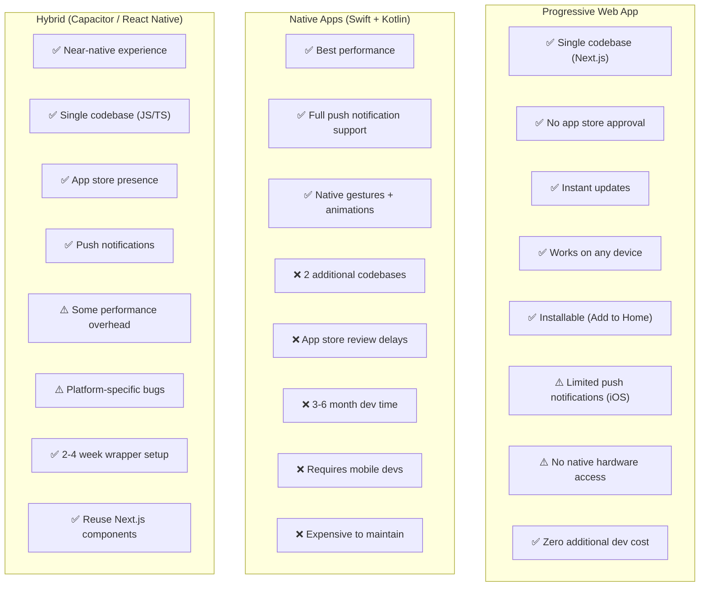

### Decision: PWA First → Capacitor Wrapper for App Stores

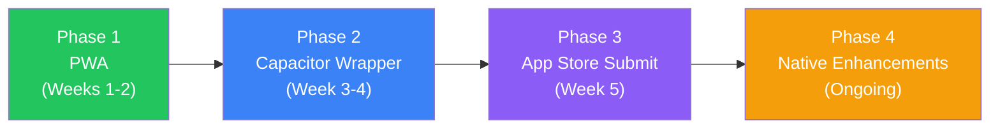

**Why this approach:**
- **PWA gets us to mobile in days, not months** — we're already building a Next.js app
- **Capacitor wraps the PWA into native shells** — same code, but in App Store / Play Store
- **No separate mobile team needed** — one codebase serves web, iOS, and Android
- **Upgrade path:** If we need native features later (biometrics, camera for OCR), Capacitor supports native plugins

---

## 3. Platform Architecture

### Cross-Platform Architecture

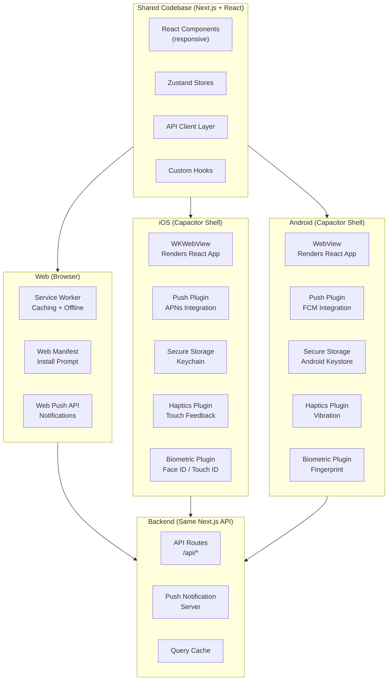

### Request Flow: Mobile → API

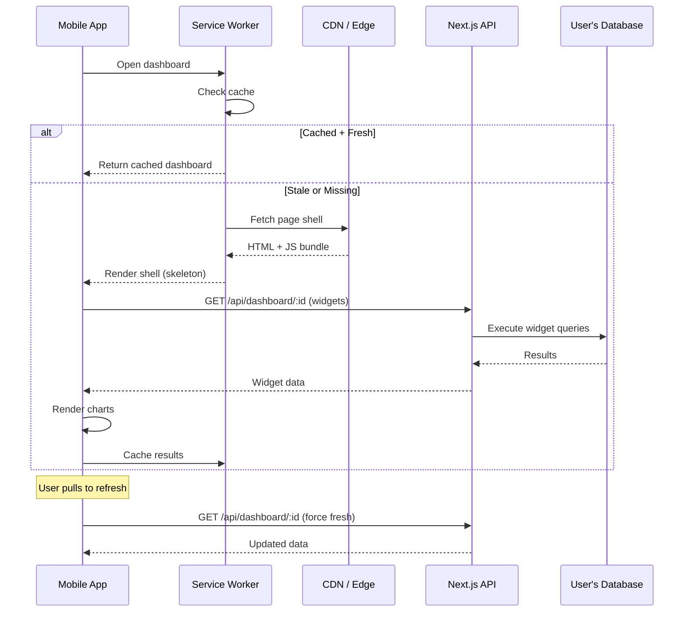

---

## 4. Mobile-Specific Features

### Feature Matrix: Desktop vs Mobile

| Feature | Desktop | Mobile | Mobile Notes |
|---|---|---|---|
| **Chat (ask questions)** | ✅ Full | ✅ Full | Voice input support |
| **View dashboards** | ✅ Full | ✅ Adapted | Single-column stack |
| **Create dashboards** | ✅ Full | ❌ No | Too complex for small screen |
| **Edit dashboard layout** | ✅ Drag/resize | ❌ No | Desktop only |
| **View charts** | ✅ Full | ✅ Adapted | Touch-friendly, swipeable |
| **View data tables** | ✅ Full | ✅ Adapted | Horizontal scroll, fixed first column |
| **Saved queries** | ✅ Full | ✅ Run only | Can run, not edit |
| **Notifications** | ✅ Browser | ✅ Push | Native push via Capacitor |
| **File upload** | ✅ Drag-drop | ✅ File picker | OS file picker / camera |
| **Data profiling** | ✅ Full dashboard | ✅ Summary cards | Simplified view |
| **Transform pipeline** | ✅ Full builder | ⚠️ View only | Can view, not build |
| **Export** | ✅ All formats | ✅ Share sheet | OS share sheet integration |
| **Team management** | ✅ Full | ⚠️ Basic | Invite only, no role editing |
| **Connections setup** | ✅ Full | ❌ No | Desktop only (security) |
| **Scheduled reports** | ✅ Full config | ⚠️ View/toggle | Can pause/resume, not create |
| **Offline access** | ❌ No | ✅ Cached dashboards | Last-viewed dashboards available offline |
| **Biometric auth** | ❌ No | ✅ Face ID / Fingerprint | Quick re-authentication |
| **Voice input** | ❌ No | ✅ Speech-to-text | Ask questions by voice |
| **Haptic feedback** | ❌ No | ✅ Native | Tap feedback, pull-to-refresh |
| **Deep links** | N/A | ✅ Universal links | Open specific dashboard from notification |
| **Widgets (iOS/Android)** | N/A | ✅ Home screen | KPI widgets on home screen |

### Mobile-Only Features

#### Voice Query Input

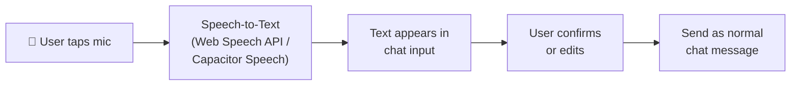

#### Home Screen Widgets (Phase 3)

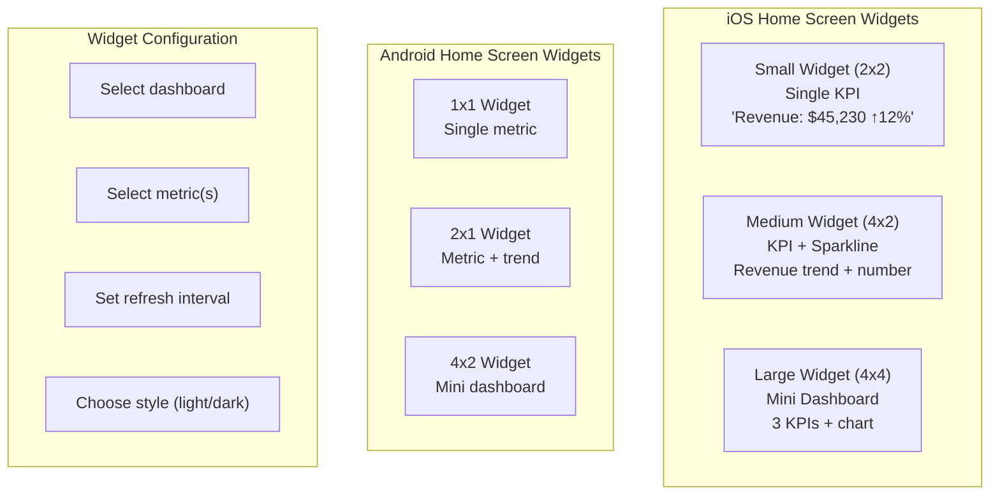

#### Swipe Gestures

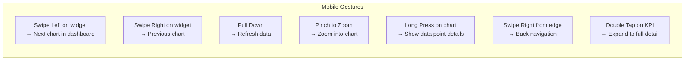

---

## 5. Responsive Design System

### Breakpoint Strategy

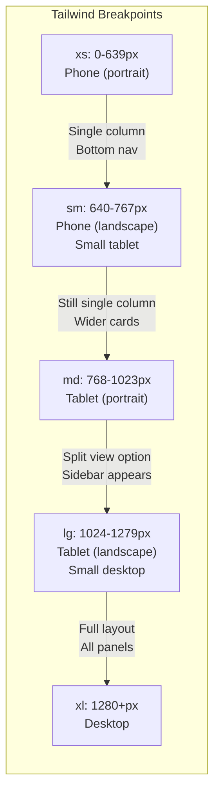

### Layout Adaptation

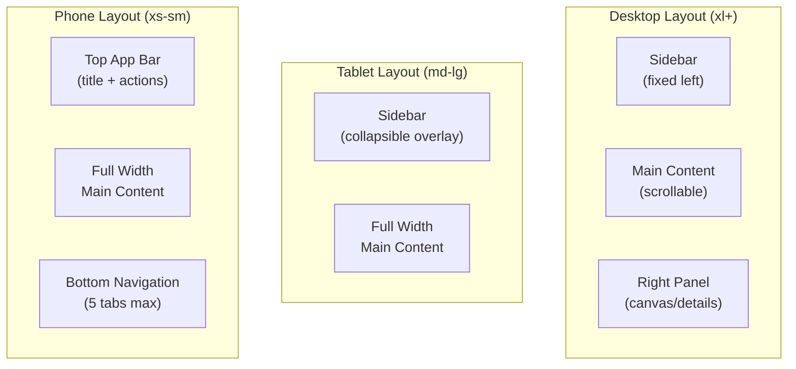

### Dashboard Responsiveness

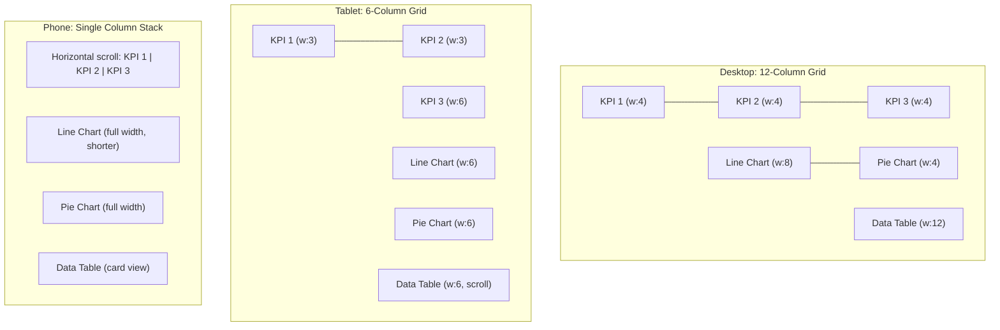

### Mobile Component Adaptations

| Component | Desktop | Mobile Adaptation |
|---|---|---|
| **KPI Cards** | Grid of 3-4 across | Horizontal scroll carousel |
| **Line/Bar Chart** | Full size with legend | Compact, legend below, touch tooltips |
| **Pie Chart** | With labels | Donut with center value, tap for labels |
| **Data Table** | Full columns visible | First column fixed, horizontal scroll |
| **Chat Thread** | Side-by-side with canvas | Full screen, swipe to canvas |
| **Profile Dashboard** | Grid of column cards | Vertical stack, expandable cards |
| **Transform Pipeline** | Visual step flow | Compact list, expandable steps |
| **Export Dialog** | Modal with options | Full-screen sheet |
| **Filter Bar** | Horizontal bar | Collapsible chip row + filter sheet |
| **Navigation** | Left sidebar | Bottom tab bar (5 tabs) |

---

## 6. Mobile User Flows

### Flow 1: Morning Dashboard Check (Most Common)

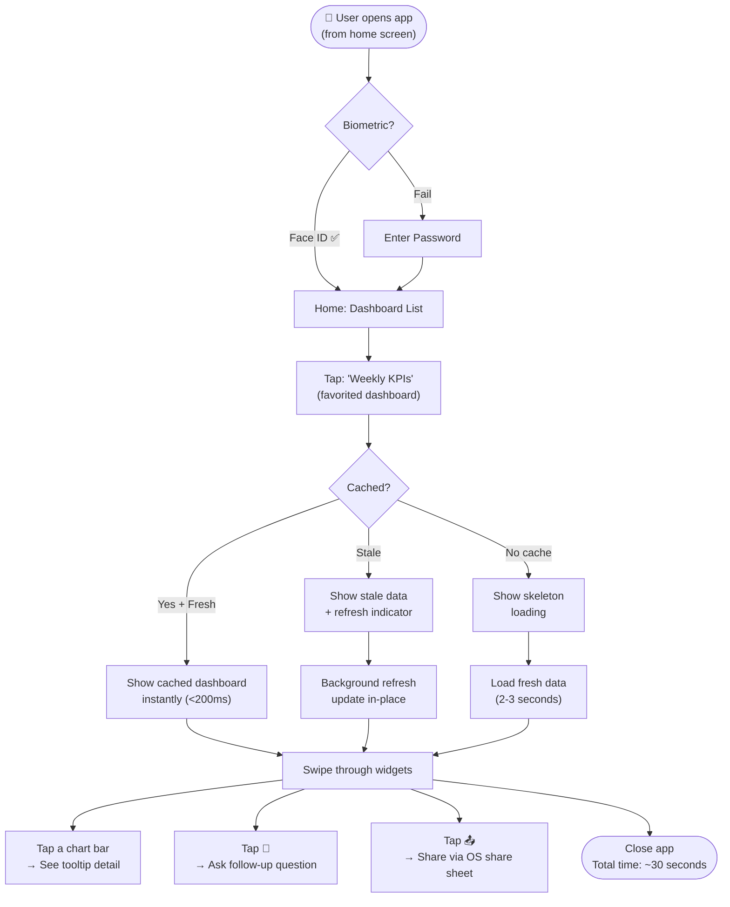

### Flow 2: Quick Question on the Go

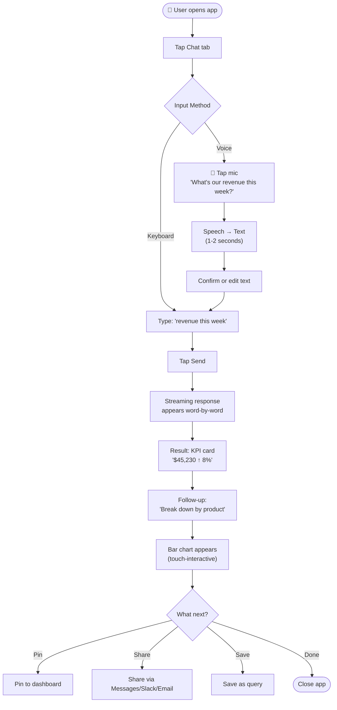

### Flow 3: Alert Response

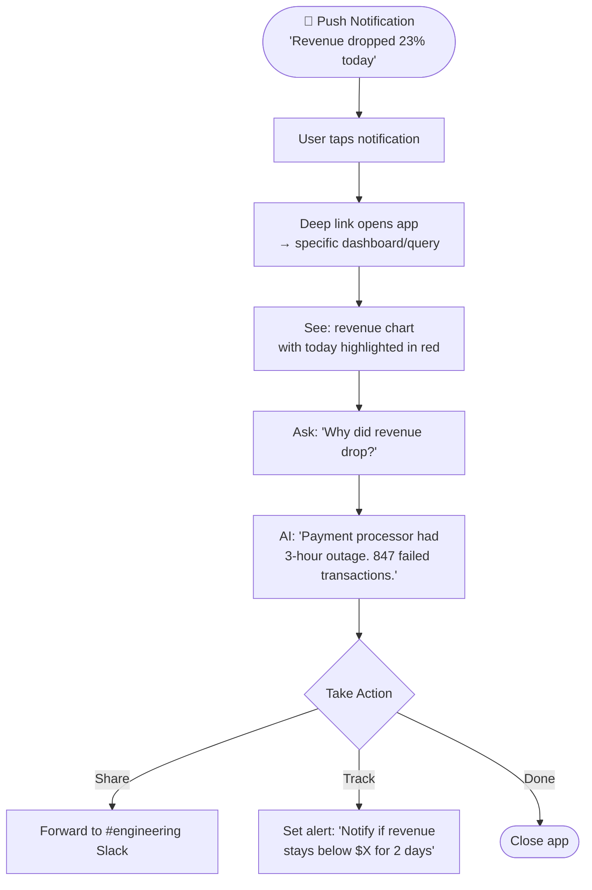

### Flow 4: File Upload from Phone

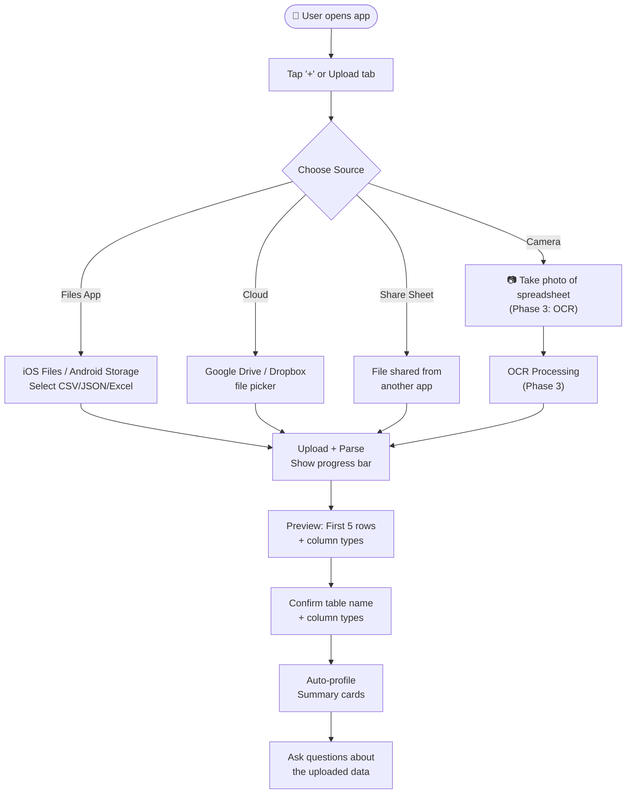

---

## 7. Push Notifications

### Notification Architecture

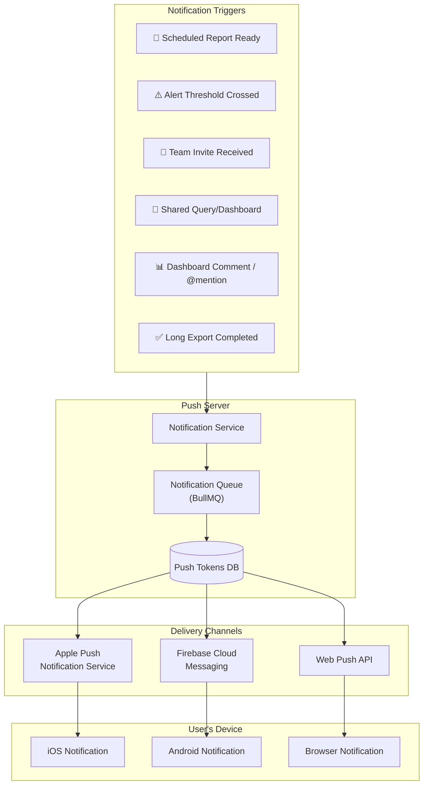

### Notification Types & Actions

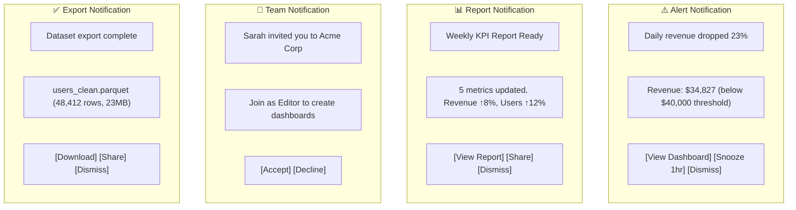

### Notification Preferences

```typescript
interface NotificationPreferences {
  userId: string;

  // Global
  enabled: boolean;
  quietHours?: {
    enabled: boolean;
    start: string;         // "22:00"
    end: string;           // "08:00"
    timezone: string;
  };

  // Per category
  alerts: {
    push: boolean;         // Mobile push
    email: boolean;
    inApp: boolean;        // In-app notification center
  };
  reports: {
    push: boolean;
    email: boolean;
    inApp: boolean;
  };
  team: {
    push: boolean;
    email: boolean;
    inApp: boolean;
  };
  exports: {
    push: boolean;
    email: boolean;
    inApp: boolean;
  };
}
```

**Acceptance Criteria:**
- [ ] Push notifications work on iOS (via APNs) and Android (via FCM)
- [ ] Tapping a notification deep-links to the relevant dashboard/query
- [ ] Users can configure notification preferences per category
- [ ] Quiet hours prevent notifications during sleep
- [ ] Notifications are batched (max 5/hour to avoid spam)
- [ ] Uninstalling the app clears the push token server-side

---

## 8. Offline Capabilities

### Offline Strategy

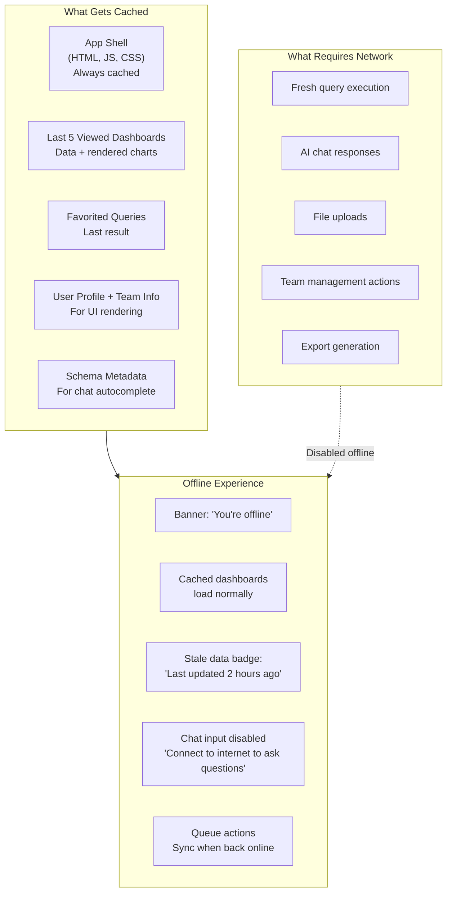

### Service Worker Caching Strategy

```mermaid
flowchart TB
    subgraph SW["Service Worker"]
        Request["Incoming Request"] --> Route{Route Type}

        Route -->|App Shell<br/>(HTML, JS, CSS)| CacheFirst["Cache First<br/>Fallback to network"]
        Route -->|API: Dashboard Data| StaleWhile["Stale While Revalidate<br/>Return cache, refresh in bg"]
        Route -->|API: Chat / Query| NetworkOnly["Network Only<br/>No caching"]
        Route -->|API: Schema| CacheThen["Cache with TTL<br/>30 min expiry"]
        Route -->|Static Assets<br/>(images, fonts)| CacheForever["Cache First<br/>Immutable (hashed names)"]
    end

    subgraph Storage["Cache Storage"]
        S1["app-shell-v1<br/>~2MB"]
        S2["dashboard-data<br/>~5MB max (LRU)"]
        S3["schema-cache<br/>~500KB"]
        S4["static-assets<br/>~3MB"]
    end

    CacheFirst --> S1
    StaleWhile --> S2
    CacheThen --> S3
    CacheForever --> S4
```

### Offline Data Budget

| Cache | Max Size | Eviction | TTL |
|---|---|---|---|
| App shell | 2 MB | Version-based | Until new deploy |
| Dashboard data | 5 MB | LRU (least recently used) | 24 hours |
| Query results | 2 MB | LRU | 1 hour |
| Schema metadata | 500 KB | Version-based | 30 minutes |
| Static assets | 3 MB | Hash-based | Immutable |
| **Total** | **~12.5 MB** | | |

**Acceptance Criteria:**
- [ ] App loads offline in <1 second (cached shell)
- [ ] Last 5 viewed dashboards are available offline
- [ ] Offline state is clearly indicated (banner + badge)
- [ ] Online/offline transitions are seamless (no page reload)
- [ ] Cache size stays under 15MB to avoid browser eviction
- [ ] Sensitive data (connection strings, tokens) is NOT cached

---

## 9. Mobile-Optimized Components

### Bottom Navigation

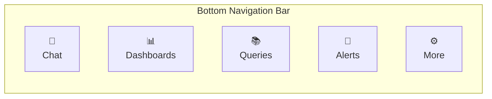

```typescript
// Bottom nav component structure
interface BottomNavTab {
  id: string;
  icon: LucideIcon;
  label: string;
  route: string;
  badge?: number;          // Unread notification count
}

const tabs: BottomNavTab[] = [
  { id: 'chat', icon: MessageSquare, label: 'Chat', route: '/chat' },
  { id: 'dashboards', icon: LayoutDashboard, label: 'Dashboards', route: '/dashboards' },
  { id: 'queries', icon: BookOpen, label: 'Queries', route: '/queries' },
  { id: 'alerts', icon: Bell, label: 'Alerts', route: '/alerts', badge: 3 },
  { id: 'more', icon: MoreHorizontal, label: 'More', route: '/more' },
];
```

### Mobile Chart Components

#### Touch-Friendly Chart Wrapper

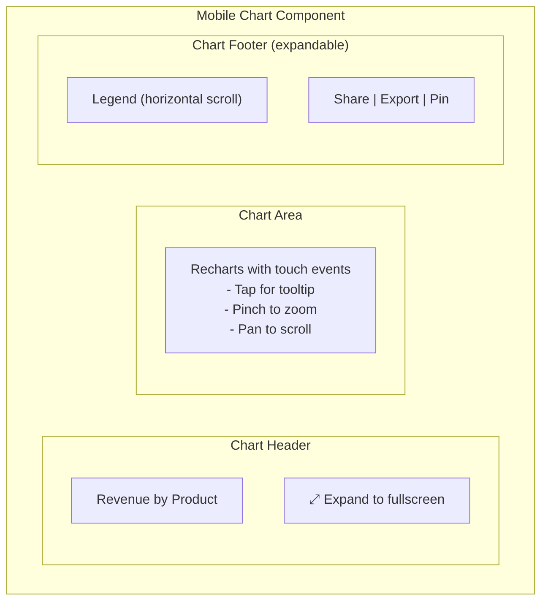

```typescript
interface MobileChartProps {
  data: unknown[];
  type: ChartType;
  title: string;

  // Mobile-specific
  height?: number;              // Default: 250px (vs 400px desktop)
  showLegend?: boolean;         // Default: false on mobile
  enableZoom?: boolean;         // Pinch to zoom
  enablePan?: boolean;          // Horizontal scroll for time series
  tooltipMode?: 'tap' | 'hold'; // How to show tooltips
  fullscreenEnabled?: boolean;  // Allow expand to fullscreen
}
```

#### Mobile Data Table

```mermaid
graph TB
    subgraph MobileTable["Mobile Data Table"]
        subgraph CardView["Card View (Default on Phone)"]
            Card1["Row 1 as Card<br/>Name: John Doe<br/>Revenue: $12,340<br/>Region: West<br/>Status: Active"]
            Card2["Row 2 as Card<br/>Name: Jane Smith<br/>Revenue: $9,870<br/>Region: East<br/>Status: Active"]
        end

        subgraph ListView["List View (Alternative)"]
            List1["John Doe — $12,340 — West"]
            List2["Jane Smith — $9,870 — East"]
        end

        subgraph TableView["Table View (Landscape / Tablet)"]
            TV["Horizontal scroll table<br/>First column frozen"]
        end

        subgraph Toggle["View Toggle"]
            T1["Card | List | Table"]
        end
    end
```

```typescript
interface MobileDataTableProps {
  data: Record<string, unknown>[];
  columns: ColumnDef[];

  // Mobile-specific
  defaultView: 'card' | 'list' | 'table';
  primaryColumn: string;        // Fixed column in table view
  summaryColumns: string[];     // Columns shown in card view
  pageSize?: number;            // Default: 20 (vs 50 desktop)
  enableInfiniteScroll: boolean;
  enableSearch: boolean;
  enableSort: boolean;
}
```

### Mobile KPI Carousel

```mermaid
graph LR
    subgraph Carousel["KPI Carousel (Horizontal Scroll)"]
        K1["Revenue<br/>$45,230<br/>↑ 12%"]
        K2["Users<br/>1,247<br/>↑ 8%"]
        K3["Churn<br/>2.1%<br/>↑ 0.3%"]
        K4["NPS<br/>72<br/>↓ 3"]
    end

    subgraph Indicators["Scroll Indicators"]
        Dots["• • ○ ○"]
    end
```

```typescript
interface KPICarouselProps {
  metrics: Array<{
    label: string;
    value: string | number;
    format: 'number' | 'currency' | 'percent';
    trend?: {
      value: number;
      direction: 'up' | 'down' | 'flat';
      isGood: boolean;          // Green if good, red if bad
    };
    sparkline?: number[];       // Last 7 data points
  }>;

  // Mobile-specific
  autoScroll?: boolean;         // Auto-advance every 5 seconds
  snapToCard?: boolean;         // Snap scrolling
  cardWidth?: 'full' | 'compact'; // Full width or peek next card
}
```

### Pull-to-Refresh

```typescript
interface PullToRefreshConfig {
  enabled: boolean;
  threshold: number;            // Pull distance to trigger (px)
  refreshFunction: () => Promise<void>;
  hapticFeedback: boolean;      // Vibrate on trigger
  loadingComponent?: React.ComponentType;
  successMessage?: string;      // "Updated just now"
}
```

### Mobile Sheet (Bottom Sheet)

```mermaid
graph TB
    subgraph Sheet["Bottom Sheet (replaces modals on mobile)"]
        Handle["━━━ Drag Handle ━━━"]
        Content["Sheet Content<br/>(filters, options, details)"]

        subgraph States["Sheet States"]
            S1["Collapsed: Just peek handle"]
            S2["Half: 50% screen height"]
            S3["Full: Near fullscreen"]
        end
    end
```

For modals, dialogs, and configuration panels — use bottom sheets on mobile instead of centered modals. They're thumb-friendly and follow platform conventions.

---

## 10. Performance Budgets

### Mobile Performance Targets

| Metric | Target | Measurement |
|---|---|---|
| **First Contentful Paint (FCP)** | < 1.5s | Lighthouse (3G throttled) |
| **Largest Contentful Paint (LCP)** | < 2.5s | Lighthouse |
| **Time to Interactive (TTI)** | < 3.5s | Lighthouse |
| **Cumulative Layout Shift (CLS)** | < 0.1 | Lighthouse |
| **First Input Delay (FID)** | < 100ms | Real User Monitoring |
| **JS Bundle Size** | < 200KB (gzipped) | Initial route bundle |
| **Total Page Weight** | < 500KB | First load (no cache) |
| **API Response Time** | < 2s | 95th percentile on 4G |
| **Offline Load Time** | < 500ms | From service worker cache |
| **Dashboard Render** | < 1.5s | Cached data, 5 widgets |
| **Chart Render** | < 300ms | Single chart component |

### Bundle Optimization Strategy

```mermaid
graph TB
    subgraph Chunks["Code Splitting Strategy"]
        Core["Core Bundle (always loaded)<br/>React, Router, Auth, Layout<br/>~80KB gzipped"]

        Chat["Chat Bundle (lazy)<br/>Chat UI, Streaming, Markdown<br/>~40KB"]
        Dash["Dashboard Bundle (lazy)<br/>Grid, Widget Renderer<br/>~50KB"]
        Charts["Charts Bundle (lazy)<br/>Recharts, Chart Components<br/>~60KB"]
        Data["Data Prep Bundle (lazy)<br/>Profiling, Transforms<br/>~35KB"]
        Admin["Admin Bundle (lazy)<br/>Team Mgmt, Connections<br/>~25KB"]
    end

    Core --> Chat
    Core --> Dash
    Dash --> Charts
    Core --> Data
    Core --> Admin
```

### Image & Asset Optimization

| Asset Type | Strategy |
|---|---|
| Chart images (for sharing) | Generate server-side, serve via CDN |
| Icons | Lucide React (tree-shaken, SVG) |
| Fonts | System font stack (no custom fonts on mobile) |
| Avatars | 48px max, WebP format |
| Logo | SVG, inline |
| Splash screen | Static HTML (no JS needed) |

---

## 11. App Store Strategy

### Capacitor Configuration

```mermaid
graph TB
    subgraph Build["Build Pipeline"]
        Next["Next.js Build<br/>npm run build"]
        Export["Static Export<br/>next export (or output: export)"]
        Cap["Capacitor Copy<br/>npx cap copy"]
        iOS["Xcode Build<br/>npx cap open ios"]
        Android["Android Studio Build<br/>npx cap open android"]
    end

    Next --> Export --> Cap
    Cap --> iOS
    Cap --> Android

    subgraph Stores["App Store Submissions"]
        AppStore["Apple App Store<br/>$99/year developer account<br/>Review: 1-3 days"]
        PlayStore["Google Play Store<br/>$25 one-time fee<br/>Review: hours-2 days"]
    end

    iOS --> AppStore
    Android --> PlayStore
```

### App Store Listing

```
App Name: DataForge — AI Database Explorer
Subtitle: Ask your database questions in plain English
Category: Business / Productivity

Description:
DataForge turns your database into a conversation.
Connect your PostgreSQL, MySQL, or MongoDB database
and ask questions in plain English. Get instant charts,
dashboards, and insights — no SQL required.

Features:
• Ask questions in natural language — get instant answers
• Beautiful auto-generated charts and dashboards
• View dashboards on the go with offline support
• Push notifications for alerts and scheduled reports
• Voice input — ask questions by speaking
• Secure: read-only access, encrypted connections
• Team collaboration with role-based access

Screenshots needed:
1. Chat interface asking a question
2. Dashboard with KPI cards and charts
3. Chart detail view with touch interaction
4. Voice input in action
5. Push notification → dashboard deep link
6. Offline mode with cached dashboard
```

### App Store Metadata

```typescript
// capacitor.config.ts
const config: CapacitorConfig = {
  appId: 'dev.dataforge.app',
  appName: 'DataForge',
  webDir: 'out',                // Next.js static export directory
  bundledWebRuntime: false,

  ios: {
    scheme: 'DataForge',
    contentInset: 'automatic',  // Safe area handling
    backgroundColor: '#ffffff',
    preferredContentMode: 'mobile',
  },

  android: {
    allowMixedContent: false,   // HTTPS only
    backgroundColor: '#ffffff',
    captureInput: true,
  },

  plugins: {
    PushNotifications: {
      presentationOptions: ['badge', 'sound', 'alert'],
    },
    SplashScreen: {
      launchShowDuration: 2000,
      backgroundColor: '#ffffff',
      showSpinner: false,
    },
    Keyboard: {
      resize: 'body',           // Resize on keyboard open
      style: 'light',
    },
    StatusBar: {
      style: 'light',
      backgroundColor: '#ffffff',
    },
    Haptics: {
      // Enabled by default
    },
  },

  server: {
    // For development: proxy to Next.js dev server
    url: process.env.NODE_ENV === 'development'
      ? 'http://localhost:3000'
      : undefined,
    cleartext: process.env.NODE_ENV === 'development',
  },
};
```

---

## 12. Technical Implementation

### Dependencies to Add

```json
{
  "dependencies": {
    "@capacitor/core": "^6.x",
    "@capacitor/ios": "^6.x",
    "@capacitor/android": "^6.x",
    "@capacitor/push-notifications": "^6.x",
    "@capacitor/haptics": "^6.x",
    "@capacitor/keyboard": "^6.x",
    "@capacitor/status-bar": "^6.x",
    "@capacitor/splash-screen": "^6.x",
    "@capacitor/share": "^6.x",
    "@capacitor/filesystem": "^6.x",
    "@capacitor/browser": "^6.x",
    "@capacitor/local-notifications": "^6.x",
    "@capacitor/app": "^6.x",
    "@capacitor/network": "^6.x",
    "workbox-webpack-plugin": "^7.x",
    "next-pwa": "^5.x"
  },
  "devDependencies": {
    "@capacitor/cli": "^6.x"
  }
}
```

### File Structure (New — Mobile specific)

```
├── capacitor.config.ts              # Capacitor configuration
├── ios/                             # Generated iOS project
│   └── App/                         # Xcode project files
├── android/                         # Generated Android project
│   └── app/                         # Android Studio project files
├── public/
│   ├── manifest.json                # PWA manifest
│   ├── sw.js                        # Service worker
│   ├── icons/                       # App icons (all sizes)
│   │   ├── icon-72x72.png
│   │   ├── icon-96x96.png
│   │   ├── icon-128x128.png
│   │   ├── icon-144x144.png
│   │   ├── icon-152x152.png
│   │   ├── icon-192x192.png
│   │   ├── icon-384x384.png
│   │   ├── icon-512x512.png
│   │   └── apple-touch-icon.png
│   └── splash/                      # Splash screen images
│       ├── splash-2048x2732.png     # iPad Pro
│       ├── splash-1668x2388.png     # iPad Air
│       ├── splash-1290x2796.png     # iPhone 15 Pro Max
│       ├── splash-1179x2556.png     # iPhone 15 Pro
│       └── splash-1170x2532.png     # iPhone 15
├── src/
│   ├── lib/
│   │   ├── mobile/
│   │   │   ├── capacitor.ts         # Capacitor plugin wrappers
│   │   │   ├── push.ts             # Push notification handlers
│   │   │   ├── haptics.ts          # Haptic feedback utility
│   │   │   ├── share.ts            # OS share sheet wrapper
│   │   │   ├── offline.ts          # Offline detection + cache mgmt
│   │   │   ├── deep-links.ts       # Universal link handling
│   │   │   ├── keyboard.ts         # Keyboard avoidance helpers
│   │   │   ├── safe-area.ts        # Safe area inset utilities
│   │   │   └── platform.ts         # Platform detection (web/ios/android)
│   │   └── pwa/
│   │       ├── service-worker.ts    # SW registration + lifecycle
│   │       ├── cache-strategy.ts    # Cache strategies per route
│   │       └── install-prompt.ts    # PWA install prompt handler
│   ├── components/
│   │   ├── mobile/
│   │   │   ├── bottom-nav.tsx       # Bottom tab navigation
│   │   │   ├── bottom-sheet.tsx     # Draggable bottom sheet
│   │   │   ├── pull-to-refresh.tsx  # Pull-to-refresh wrapper
│   │   │   ├── mobile-chart.tsx     # Touch-optimized chart wrapper
│   │   │   ├── kpi-carousel.tsx     # Horizontal scroll KPI cards
│   │   │   ├── mobile-data-table.tsx # Card/list/table toggle
│   │   │   ├── voice-input.tsx      # Speech-to-text input
│   │   │   ├── offline-banner.tsx   # Offline indicator
│   │   │   ├── install-prompt.tsx   # "Add to Home Screen" prompt
│   │   │   ├── safe-area-view.tsx   # Safe area padding wrapper
│   │   │   └── swipe-action.tsx     # Swipe gesture handler
│   │   └── layout/
│   │       ├── responsive-layout.tsx # Desktop sidebar vs mobile bottom nav
│   │       └── mobile-header.tsx    # Mobile top bar
│   ├── hooks/
│   │   ├── use-platform.ts          # Detect web/ios/android
│   │   ├── use-online-status.ts     # Network connectivity
│   │   ├── use-viewport.ts          # Window size + breakpoint
│   │   ├── use-safe-area.ts         # Safe area insets
│   │   ├── use-haptics.ts           # Haptic feedback hook
│   │   └── use-pull-to-refresh.ts   # Pull-to-refresh logic
│   └── styles/
│       └── mobile.css               # Mobile-specific overrides
```

### PWA Manifest

```json
{
  "name": "DataForge — AI Database Explorer",
  "short_name": "DataForge",
  "description": "Ask your database questions in plain English",
  "start_url": "/",
  "display": "standalone",
  "orientation": "any",
  "background_color": "#ffffff",
  "theme_color": "#3b82f6",
  "categories": ["business", "productivity"],
  "icons": [
    { "src": "/icons/icon-192x192.png", "sizes": "192x192", "type": "image/png" },
    { "src": "/icons/icon-512x512.png", "sizes": "512x512", "type": "image/png" },
    { "src": "/icons/icon-512x512.png", "sizes": "512x512", "type": "image/png", "purpose": "maskable" }
  ],
  "screenshots": [
    { "src": "/screenshots/chat.png", "sizes": "390x844", "type": "image/png", "form_factor": "narrow" },
    { "src": "/screenshots/dashboard.png", "sizes": "390x844", "type": "image/png", "form_factor": "narrow" },
    { "src": "/screenshots/desktop.png", "sizes": "1920x1080", "type": "image/png", "form_factor": "wide" }
  ],
  "share_target": {
    "action": "/upload",
    "method": "POST",
    "enctype": "multipart/form-data",
    "params": {
      "files": [{ "name": "file", "accept": ["text/csv", "application/json", ".parquet", ".xlsx"] }]
    }
  }
}
```

### Platform Detection Hook

```typescript
// src/hooks/use-platform.ts
import { Capacitor } from '@capacitor/core';

type Platform = 'web' | 'ios' | 'android';

interface PlatformInfo {
  platform: Platform;
  isNative: boolean;           // Running in Capacitor shell
  isMobile: boolean;           // Mobile viewport (any platform)
  isTablet: boolean;           // Tablet viewport
  isDesktop: boolean;          // Desktop viewport
  isPWA: boolean;              // Installed as PWA
  isOnline: boolean;           // Network connectivity
  hasPushSupport: boolean;     // Can receive push notifications
  hasHaptics: boolean;         // Haptic feedback available
  hasBiometrics: boolean;      // Face ID / Fingerprint available
  safeAreaInsets: {
    top: number;
    bottom: number;
    left: number;
    right: number;
  };
}

function usePlatform(): PlatformInfo {
  // Implementation uses Capacitor.getPlatform(),
  // window.matchMedia, and navigator APIs
}
```

### Responsive Layout Component

```typescript
// src/components/layout/responsive-layout.tsx
// Renders sidebar on desktop, bottom nav on mobile

interface ResponsiveLayoutProps {
  children: React.ReactNode;
}

function ResponsiveLayout({ children }: ResponsiveLayoutProps) {
  const { isMobile, isTablet } = usePlatform();

  if (isMobile) {
    return (
      <SafeAreaView>
        <MobileHeader />
        <main className="flex-1 overflow-y-auto pb-16">
          {children}
        </main>
        <BottomNav />
        <OfflineBanner />
      </SafeAreaView>
    );
  }

  if (isTablet) {
    return (
      <div className="flex h-screen">
        <CollapsibleSidebar />
        <main className="flex-1 overflow-y-auto">
          {children}
        </main>
      </div>
    );
  }

  // Desktop
  return (
    <div className="flex h-screen">
      <Sidebar />
      <main className="flex-1 overflow-y-auto">
        {children}
      </main>
    </div>
  );
}
```

---

## 13. Phasing & Milestones

### Mobile Development Phases

```mermaid
gantt
    title Mobile Development Timeline
    dateFormat  YYYY-MM-DD
    section Phase M1: PWA Foundation (Weeks 1-2)
        PWA manifest + icons              :m1, 2026-03-25, 2d
        Service worker setup              :m2, after m1, 2d
        Responsive breakpoints            :m3, 2026-03-25, 3d
        Bottom navigation component       :m4, after m3, 2d
        Mobile header component           :m5, after m4, 1d
        Responsive layout wrapper         :m6, after m3, 3d
        Mobile chart wrapper              :m7, 2026-03-29, 3d
        KPI carousel component            :m8, after m7, 2d
        Mobile data table (card view)     :m9, after m8, 2d
        Pull-to-refresh                   :m10, 2026-04-01, 2d
        Bottom sheet component            :m11, after m10, 2d
        PWA install prompt                :m12, after m11, 1d

    section Phase M2: Capacitor Wrapper (Weeks 3-4)
        Capacitor project setup           :m13, 2026-04-07, 2d
        iOS shell configuration           :m14, after m13, 2d
        Android shell configuration       :m15, after m13, 2d
        Push notification setup           :m16, after m14, 3d
        Haptic feedback integration       :m17, after m14, 1d
        Deep link configuration           :m18, after m16, 2d
        Safe area handling                :m19, 2026-04-07, 2d
        Keyboard avoidance                :m20, after m19, 2d
        Voice input (Speech-to-Text)      :m21, after m20, 3d
        OS share sheet integration        :m22, after m17, 2d
        Biometric auth (Face ID/Touch ID) :m23, after m18, 2d
        Offline detection + banner        :m24, 2026-04-14, 2d

    section Phase M3: App Store (Week 5)
        App icons (all sizes)             :m25, 2026-04-21, 1d
        Splash screens                    :m26, after m25, 1d
        App Store screenshots             :m27, after m26, 2d
        App Store listing + metadata      :m28, after m27, 1d
        iOS TestFlight build              :m29, after m26, 2d
        Android internal test build       :m30, after m26, 2d
        Submit to App Store               :m31, after m29, 1d
        Submit to Play Store              :m32, after m30, 1d

    section Phase M4: Native Enhancements (Ongoing)
        Home screen widgets (iOS)         :m33, 2026-04-28, 5d
        Home screen widgets (Android)     :m34, after m33, 5d
        Background refresh                :m35, 2026-04-28, 3d
        Camera OCR (spreadsheet scan)     :m36, 2026-05-05, 5d
        Apple Watch complication (KPI)    :m37, after m36, 5d
        Siri shortcut ("Ask DataForge")   :m38, after m37, 3d
```

### Mobile Phase Dependencies on Main Phases

```mermaid
graph TB
    subgraph MainPhases["Main Development Phases"]
        P1A["Phase 1A<br/>Foundation<br/>(Weeks 1-3)"]
        P1B["Phase 1B<br/>Data Prep Core<br/>(Weeks 4-7)"]
        P2A["Phase 2A<br/>Auth & Team<br/>(Weeks 8-11)"]
        P2B["Phase 2B<br/>Dashboards<br/>(Weeks 12-15)"]
        P2C["Phase 2C<br/>Sharing & Scheduling<br/>(Weeks 16-19)"]
    end

    subgraph MobilePhases["Mobile Phases"]
        M1["Phase M1<br/>PWA Foundation<br/>(Parallel with P1A)"]
        M2["Phase M2<br/>Capacitor Wrapper<br/>(After M1)"]
        M3["Phase M3<br/>App Store<br/>(After M2)"]
        M4["Phase M4<br/>Native Enhancements<br/>(Ongoing)"]
    end

    P1A -->|"Responsive components<br/>needed"| M1
    M1 --> M2
    M2 --> M3
    P2A -->|"Auth needed for<br/>push + biometrics"| M2
    P2B -->|"Dashboard components<br/>needed for mobile"| M3
    P2C -->|"Push notifications<br/>need scheduling"| M4
    M3 --> M4
```

---

## 14. Open Questions & Risks

### Open Questions

| # | Question | Impact | Decision Needed By |
|---|---|---|---|
| 1 | PWA or Capacitor first? PWA is faster but Capacitor gives push on iOS. | Timeline | Phase M1 start |
| 2 | Should we use `next export` (static) or keep SSR for mobile? Static is needed for Capacitor. | Architecture | Phase M1 start |
| 3 | Chart library: Recharts on mobile, or switch to a lighter library (visx, lightweight-charts)? | Bundle size | Phase M1 |
| 4 | Do we need a separate mobile API or can mobile hit the same endpoints? | API design | Phase M2 |
| 5 | Home screen widgets: worth the effort? iOS requires SwiftUI, Android requires Kotlin. | Scope | Phase M4 |
| 6 | Apple Watch: is a KPI complication useful or gimmicky? | Scope | Phase M4 |
| 7 | Tablet: should we have a distinct tablet layout or just responsive desktop? | UX design | Phase M1 |

### Risks

| Risk | Likelihood | Impact | Mitigation |
|---|---|---|---|
| Next.js `output: 'export'` limits API routes | High | High | Use separate API deployment or keep SSR mode and use Capacitor's server proxy |
| iOS PWA limitations (no push before iOS 16.4) | Low | Medium | Capacitor wrapper handles push natively |
| App Store rejection (web wrapper apps) | Medium | High | Add native features (biometrics, push, haptics) to differentiate from "just a website" |
| Bundle too large for fast mobile load | Medium | Medium | Aggressive code splitting + tree shaking + lazy loading |
| Chart rendering slow on older phones | Medium | Medium | Reduce data points on mobile, use canvas-based charts |
| Offline cache stale data confuses users | Medium | Low | Clear "last updated" timestamps + stale data styling |
| Capacitor version conflicts with Next.js | Low | Medium | Pin versions, test in CI |

### App Store Rejection Mitigations

Apple specifically rejects apps that are "just a website in a wrapper." To avoid rejection:

1. **Push notifications** — uses native APNs (not web push)
2. **Biometric auth** — Face ID / Touch ID
3. **Haptic feedback** — native vibration patterns
4. **Home screen widgets** — native SwiftUI widgets
5. **Voice input** — native speech recognition
6. **Share sheet** — native iOS share extension
7. **Offline mode** — works without internet
8. **Deep links** — universal links open specific content

These collectively demonstrate native integration beyond a web wrapper.

---

## Appendix A: Mobile-First Design Tokens

```css
/* Mobile-specific design tokens */
:root {
  /* Touch targets — minimum 44px per Apple HIG */
  --touch-target-min: 44px;
  --touch-target-comfortable: 48px;

  /* Spacing — thumb-friendly */
  --mobile-padding: 16px;
  --mobile-gap: 12px;
  --mobile-section-gap: 24px;

  /* Typography — readable on small screens */
  --mobile-font-size-xs: 11px;
  --mobile-font-size-sm: 13px;
  --mobile-font-size-base: 15px;    /* iOS default */
  --mobile-font-size-lg: 17px;
  --mobile-font-size-xl: 20px;
  --mobile-font-size-2xl: 24px;
  --mobile-font-size-3xl: 34px;     /* Large titles */

  /* Chart heights — smaller on mobile */
  --chart-height-mobile: 220px;
  --chart-height-tablet: 320px;
  --chart-height-desktop: 400px;

  /* Bottom nav */
  --bottom-nav-height: 56px;
  --bottom-nav-icon-size: 24px;
  --bottom-nav-label-size: 10px;

  /* Bottom sheet */
  --sheet-border-radius: 16px;
  --sheet-handle-width: 36px;
  --sheet-handle-height: 5px;

  /* Safe areas (overridden by env()) */
  --safe-area-top: env(safe-area-inset-top, 0px);
  --safe-area-bottom: env(safe-area-inset-bottom, 0px);
  --safe-area-left: env(safe-area-inset-left, 0px);
  --safe-area-right: env(safe-area-inset-right, 0px);
}

/* System font stack — fastest loading, platform-native feel */
body {
  font-family: -apple-system, BlinkMacSystemFont, 'Segoe UI', Roboto,
    'Helvetica Neue', Arial, sans-serif;
}
```

---

## Appendix B: Full Platform Feature Matrix

```mermaid
graph TB
    subgraph Features["Complete Feature × Platform Matrix"]
        subgraph Core["Core Features"]
            F1["Chat (text input)      — Web ✅  iOS ✅  Android ✅"]
            F2["Chat (voice input)     — Web ⚠️  iOS ✅  Android ✅"]
            F3["View dashboards        — Web ✅  iOS ✅  Android ✅"]
            F4["Create dashboards      — Web ✅  iOS ❌  Android ❌"]
            F5["Edit dashboard layout  — Web ✅  iOS ❌  Android ❌"]
            F6["View charts            — Web ✅  iOS ✅  Android ✅"]
            F7["Interactive charts     — Web ✅  iOS ✅  Android ✅"]
            F8["Data tables            — Web ✅  iOS ✅  Android ✅"]
        end

        subgraph DataPrep["Data Prep (Option A)"]
            F9["File upload            — Web ✅  iOS ✅  Android ✅"]
            F10["Data profiling         — Web ✅  iOS ⚠️  Android ⚠️"]
            F11["Transform pipeline     — Web ✅  iOS 👁️  Android 👁️"]
            F12["Dataset export         — Web ✅  iOS ✅  Android ✅"]
            F13["Dataset splitting      — Web ✅  iOS ❌  Android ❌"]
        end

        subgraph TeamBI["Team BI (Option B)"]
            F14["Saved queries          — Web ✅  iOS ✅  Android ✅"]
            F15["Shared links           — Web ✅  iOS ✅  Android ✅"]
            F16["Scheduled reports      — Web ✅  iOS ⚠️  Android ⚠️"]
            F17["Team management        — Web ✅  iOS ⚠️  Android ⚠️"]
            F18["Connection setup       — Web ✅  iOS ❌  Android ❌"]
        end

        subgraph Mobile["Mobile-Only"]
            F19["Push notifications     — Web ⚠️  iOS ✅  Android ✅"]
            F20["Biometric auth         — Web ❌  iOS ✅  Android ✅"]
            F21["Haptic feedback        — Web ❌  iOS ✅  Android ✅"]
            F22["Home screen widgets    — Web ❌  iOS ✅  Android ✅"]
            F23["Offline dashboards     — Web ⚠️  iOS ✅  Android ✅"]
            F24["Deep links             — Web N/A iOS ✅  Android ✅"]
            F25["OS share sheet         — Web ❌  iOS ✅  Android ✅"]
        end
    end
```

Legend: ✅ Full support | ⚠️ Limited | 👁️ View only | ❌ Not available

---

*End of PRD — Mobile Strategy*
