# PRD: Option A — AI Data Prep for ML Engineers

> **Product Name:** DataForge (working title)
> **Tagline:** "From raw database to ML-ready dataset in minutes, not days."
> **Version:** 1.0
> **Date:** 2026-03-19
> **Author:** Kartik Garg

---

## Table of Contents

1. [Problem Statement](#1-problem-statement)
2. [Target Users](#2-target-users)
3. [Product Vision](#3-product-vision)
4. [System Architecture](#4-system-architecture)
5. [Feature Breakdown](#5-feature-breakdown)
6. [User Flows](#6-user-flows)
7. [Data Pipeline Architecture](#7-data-pipeline-architecture)
8. [API Design](#8-api-design)
9. [UI/UX Specifications](#9-uiux-specifications)
10. [Technical Requirements](#10-technical-requirements)
11. [Database Schema](#11-database-schema)
12. [Security & Privacy](#12-security--privacy)
13. [Performance Requirements](#13-performance-requirements)
14. [Success Metrics](#14-success-metrics)
15. [Milestones & Phasing](#15-milestones--phasing)
16. [Open Questions & Risks](#16-open-questions--risks)

---

## 1. Problem Statement

ML engineers spend **60-80% of their time** on data preparation — not model building. The current workflow is fragmented:

1. Connect to a database using a CLI or GUI client (DBeaver, pgAdmin)
2. Write exploratory SQL to understand the data
3. Export to CSV
4. Open in Jupyter/Pandas for cleaning
5. Write Python scripts for transformations
6. Profile data quality manually
7. Split into train/test/validation sets
8. Export to a format the training pipeline accepts
9. Repeat steps 2-8 every time the source data changes

**There is no single tool that handles the full path from "raw database" → "clean, profiled, split, exported ML-ready dataset."**

### What Exists Today (and why it's not enough)

| Tool | Gap |
|------|-----|
| **Jupyter + Pandas** | Manual, no DB integration, no profiling UI, notebook hell |
| **Metabase / Hex** | Built for BI analysts, not ML. No export to Parquet/HF, no splitting |
| **Great Expectations** | Validation only — doesn't help you clean or transform |
| **dbt** | SQL transforms only, no profiling, no export, steep learning curve |
| **Cleanlab** | Focused on label quality, not general data prep |
| **AWS Glue / Dataprep** | Enterprise, expensive, overkill for most teams |

---

## 2. Target Users

### Primary: ML Engineers & Data Scientists

- **Profile:** 1-10 years experience, Python-fluent, SQL-comfortable
- **Team size:** Solo to 5-person ML teams
- **Pain:** Spend more time on data than models
- **Current tools:** Jupyter, Pandas, SQLAlchemy, DBeaver
- **Willingness to pay:** $29-99/mo for a tool that saves 10+ hours/week

### Secondary: Analytics Engineers

- **Profile:** SQL-first, some Python, work at data-forward startups
- **Pain:** Need to hand off clean datasets to ML team
- **Current tools:** dbt, Metabase, Looker

### Anti-Personas (NOT building for)

- Enterprise BI teams (they have Tableau/Power BI)
- No-code business users (they need Metabase)
- Data engineers building production pipelines (they need Airflow/Dagster)

---

## 3. Product Vision

### High-Level Architecture

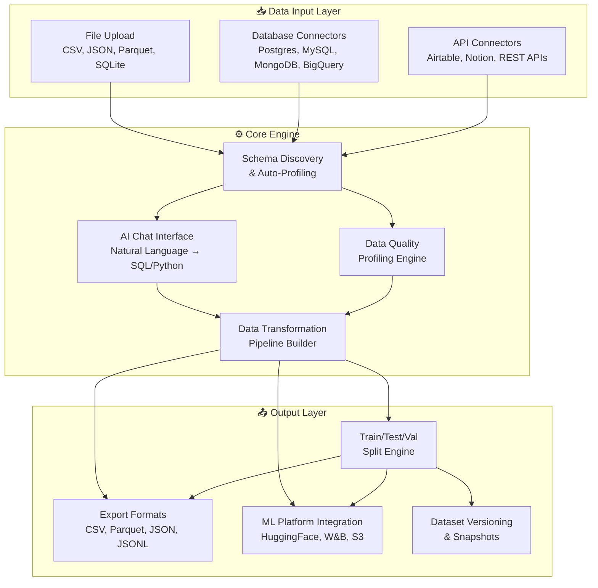

### Core Value Proposition

**"Connect. Explore. Clean. Export."** — Four steps to go from raw data to ML-ready dataset.

---

## 4. System Architecture

### Full Technical Architecture

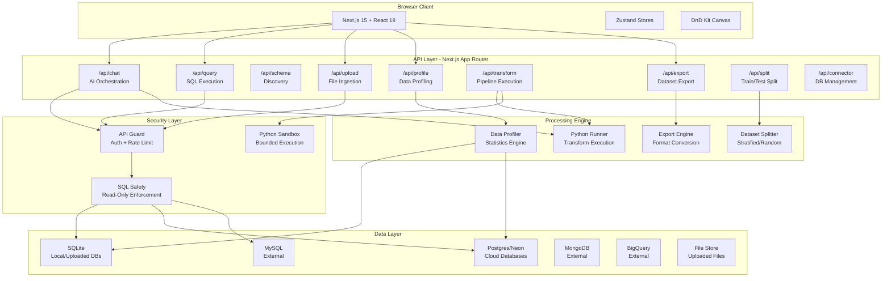

### Component Interaction Flow

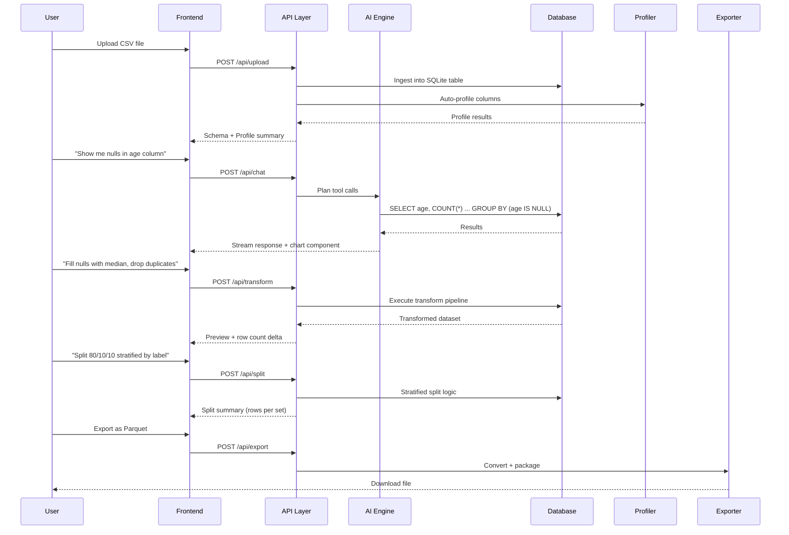

---

## 5. Feature Breakdown

### F1: File Upload & Ingestion

**Priority:** P0 (Must Have)
**Effort:** Medium

| Requirement | Details |
|---|---|
| Supported formats | CSV, TSV, JSON, JSONL, Parquet, SQLite, Excel (.xlsx) |
| Max file size | 500MB (local), 100MB (cloud) |
| Auto-detection | Delimiter, encoding, header row, data types |
| Preview | Show first 100 rows before full ingestion |
| Storage | Ingest into SQLite table (local) or temp Postgres schema |
| Naming | User can name the table, or auto-generate from filename |
| Multiple files | Support uploading multiple files as separate tables |
| Drag & drop | Drag files onto the chat area or dedicated upload zone |

**Ingestion Pipeline:**

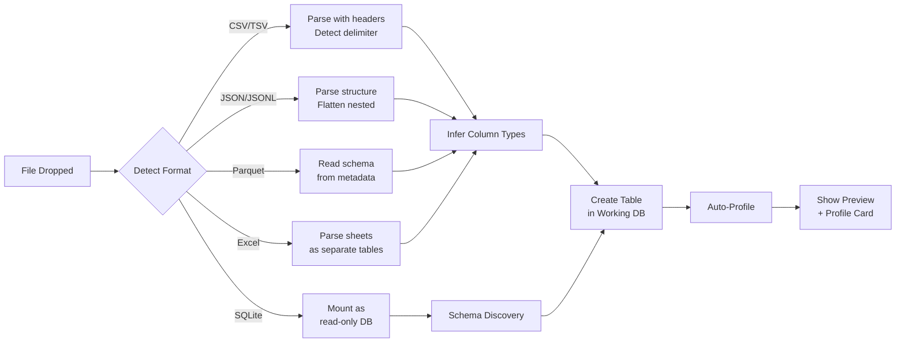

**Acceptance Criteria:**
- [ ] User can drag-drop a CSV and see it as a queryable table within 5 seconds
- [ ] Type inference is correct for >90% of columns (int, float, string, date, boolean)
- [ ] User sees row count, column count, and inferred types immediately after upload
- [ ] Duplicate uploads create versioned tables (e.g., `sales_v1`, `sales_v2`)
- [ ] Error messages are clear when file is malformed or too large

---

### F2: Multi-Database Connectors

**Priority:** P0 (Must Have)
**Effort:** High

#### Connector Matrix

| Database | Protocol | Library | Status |
|---|---|---|---|
| PostgreSQL | TCP/SSL | `pg` / `@neondatabase/serverless` | ✅ Exists |
| MySQL | TCP/SSL | `mysql2` | 🔲 New |
| SQLite | File | `better-sqlite3` | ✅ Exists |
| MongoDB | TCP/SSL | `mongodb` | 🔲 New |
| BigQuery | REST API | `@google-cloud/bigquery` | 🔲 New |
| Supabase | REST/TCP | `@supabase/supabase-js` | 🔲 New |
| ClickHouse | HTTP/TCP | `@clickhouse/client` | 🔲 Phase 2 |
| DuckDB | File/WASM | `duckdb` | 🔲 Phase 2 |

#### Connector Architecture

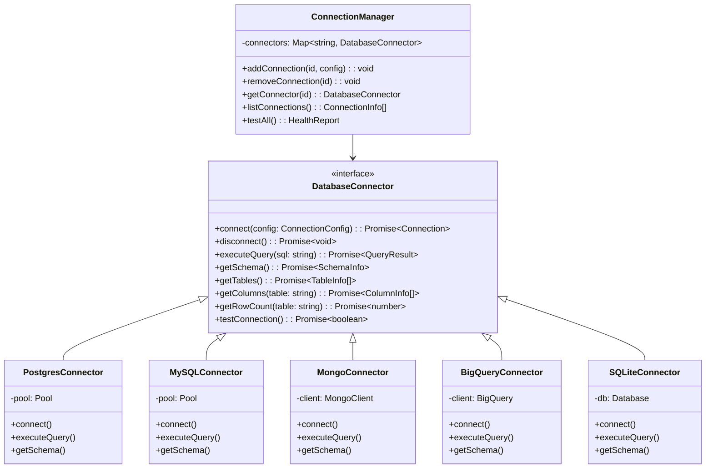

**Acceptance Criteria:**
- [ ] User can add a Postgres/MySQL connection via UI form (host, port, db, user, password)
- [ ] Connection test button validates before saving
- [ ] Saved connections persist across sessions (encrypted at rest)
- [ ] Schema discovery works uniformly across all connector types
- [ ] MongoDB collections are presented as "tables" with inferred schema
- [ ] BigQuery datasets/tables are browsable

---

### F3: Data Profiling Engine

**Priority:** P0 (Must Have)
**Effort:** Medium-High

#### Profile Report Structure

For each column in a dataset, generate:

| Metric | Applies To | Description |
|---|---|---|
| **Type** | All | Inferred type (int, float, string, date, bool, json) |
| **Null count / %** | All | Number and percentage of null/missing values |
| **Unique count / %** | All | Cardinality |
| **Most frequent values** | All | Top 10 values with counts |
| **Min / Max** | Numeric, Date | Range |
| **Mean / Median / Std** | Numeric | Central tendency and spread |
| **Percentiles** | Numeric | P25, P50, P75, P95, P99 |
| **Histogram** | Numeric | 20-bucket distribution |
| **String length stats** | String | Min/max/avg length |
| **Pattern detection** | String | Email, phone, URL, UUID patterns |
| **Date range** | Date | Earliest, latest, gaps |
| **Outlier detection** | Numeric | IQR-based outlier count |
| **Correlation matrix** | Numeric pairs | Pearson correlation between all numeric columns |

#### Profile UI Components

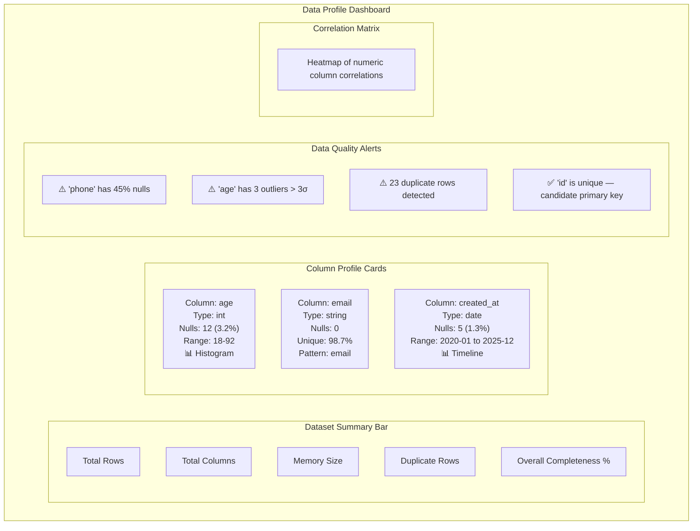

#### Profiling Pipeline

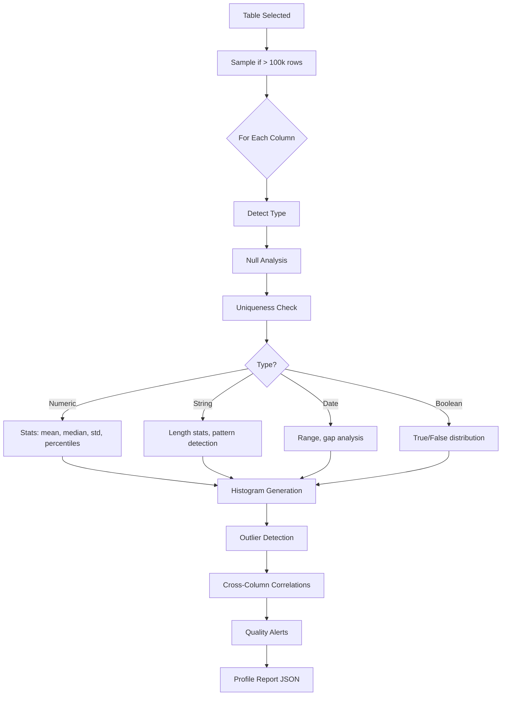

**Acceptance Criteria:**
- [ ] Profile generates in <5 seconds for datasets up to 100k rows
- [ ] For datasets >100k rows, profile uses sampling with confidence intervals
- [ ] Each column shows type, nulls, unique count, and distribution chart
- [ ] Quality alerts surface actionable issues (high nulls, outliers, duplicates)
- [ ] Correlation matrix renders as interactive heatmap
- [ ] User can click any column card to see full detail
- [ ] Profile is cached and only regenerated when data changes

---

### F4: AI-Powered Data Exploration

**Priority:** P0 (Must Have)
**Effort:** Medium (extends existing chat)

#### Chat Capabilities

The AI chat should understand and execute:

| Intent | Example Prompt | Action |
|---|---|---|
| **Explore** | "What does this dataset look like?" | Schema + profile summary |
| **Query** | "Show me all users from California" | SQL → results table |
| **Visualize** | "Plot age distribution" | SQL → histogram |
| **Profile** | "Are there any data quality issues?" | Run profiler → alerts |
| **Transform** | "Remove rows where age > 100" | Generate transform step |
| **Compare** | "Compare sales Q1 vs Q2" | SQL → side-by-side chart |
| **Explain** | "What does the orders table contain?" | Schema description + sample rows |
| **Suggest** | "What should I clean before training?" | Profile-based recommendations |

#### AI Tool Registry (Extended)

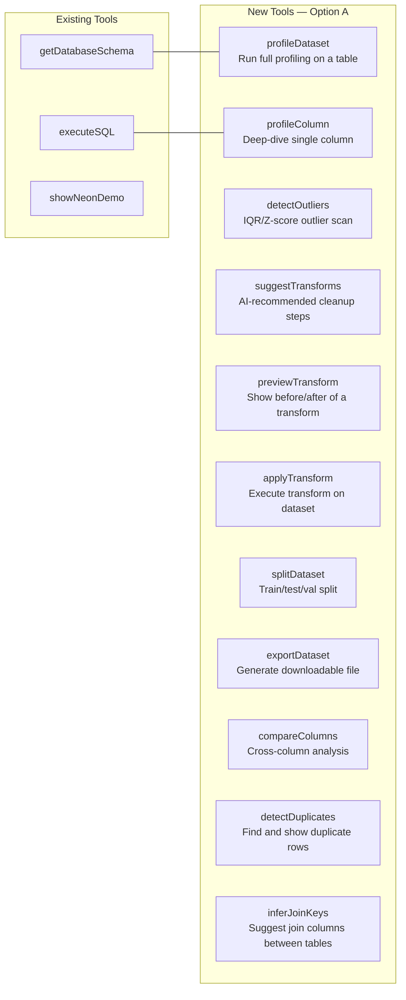

**Acceptance Criteria:**
- [ ] AI can answer "what's wrong with this data?" with actionable profiling results
- [ ] AI can chain tools: profile → suggest → preview → apply in one conversation
- [ ] All AI-generated SQL is validated through existing safety layer
- [ ] AI shows its reasoning before executing transforms (user can approve/reject)

---

### F5: Data Transformation Pipeline

**Priority:** P0 (Must Have)
**Effort:** High

#### Available Transformations

| Category | Operations |
|---|---|
| **Row Operations** | Filter rows, remove duplicates, sample, sort, limit |
| **Column Operations** | Rename, drop, reorder, cast type, add computed column |
| **Null Handling** | Fill with value/mean/median/mode, drop rows with nulls, interpolate |
| **String Operations** | Trim, lowercase, uppercase, regex replace, extract, split |
| **Numeric Operations** | Round, normalize (min-max/z-score), bin/bucket, clip outliers |
| **Date Operations** | Extract year/month/day, compute age, parse format, fill gaps |
| **Encoding** | One-hot encode, label encode, ordinal encode |
| **Aggregation** | Group by + aggregate, pivot, unpivot |
| **Join** | Inner/left/right/outer join between tables |
| **Custom** | Python transform (existing), SQL transform |

#### Transform Pipeline Architecture

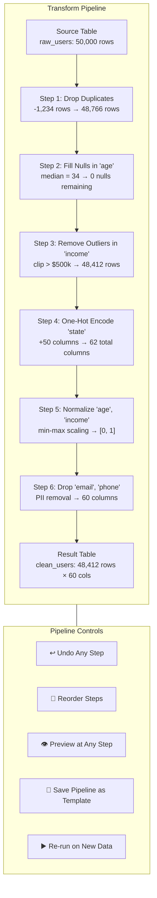

#### Transform Step Data Model

```typescript
interface TransformStep {
  id: string;
  type: TransformType;
  params: Record<string, unknown>;
  description: string;          // Human-readable
  sql?: string;                 // Generated SQL (if SQL-based)
  python?: string;              // Generated Python (if Python-based)
  inputRowCount: number;
  outputRowCount: number;
  inputColumnCount: number;
  outputColumnCount: number;
  executionTimeMs: number;
  createdAt: string;
  createdBy: 'user' | 'ai';    // Who created this step
}

interface TransformPipeline {
  id: string;
  name: string;
  sourceTable: string;
  steps: TransformStep[];
  resultTable: string;          // Materialized result
  status: 'draft' | 'executed' | 'failed';
  createdAt: string;
  updatedAt: string;
}
```

**Acceptance Criteria:**
- [ ] User can build a multi-step pipeline visually or via chat
- [ ] Each step shows row/column count delta (before vs after)
- [ ] User can preview any step without executing the full pipeline
- [ ] Pipeline can be saved and re-run on new data
- [ ] Undo/redo works for any step
- [ ] AI can suggest a full pipeline based on profiling results

---

### F6: Dataset Splitting

**Priority:** P1 (Should Have)
**Effort:** Medium

#### Split Strategies

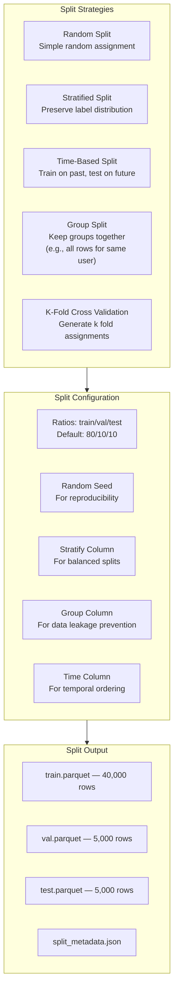

**Acceptance Criteria:**
- [ ] User can split via chat: "Split 80/10/10 stratified by label column"
- [ ] Split preserves exact ratios (±1% tolerance)
- [ ] Stratified split maintains class distribution across all splits
- [ ] Group split prevents data leakage (same user never in both train and test)
- [ ] Split metadata (seed, strategy, counts) is saved with export
- [ ] User can preview split distribution before exporting

---

### F7: Export Engine

**Priority:** P0 (Must Have)
**Effort:** Medium

#### Export Formats

| Format | Use Case | Library |
|---|---|---|
| **CSV** | Universal, Excel-compatible | Built-in |
| **Parquet** | Columnar, efficient for ML pipelines | `parquetjs` or `@duckdb/duckdb-wasm` |
| **JSON** | API-friendly, nested data | Built-in |
| **JSONL** | Streaming, LLM fine-tuning format | Built-in |
| **Arrow IPC** | Zero-copy interchange | `apache-arrow` |
| **HuggingFace Dataset** | Direct push to HF Hub | HF API |
| **SQLite** | Self-contained database file | `better-sqlite3` |

#### Export Flow

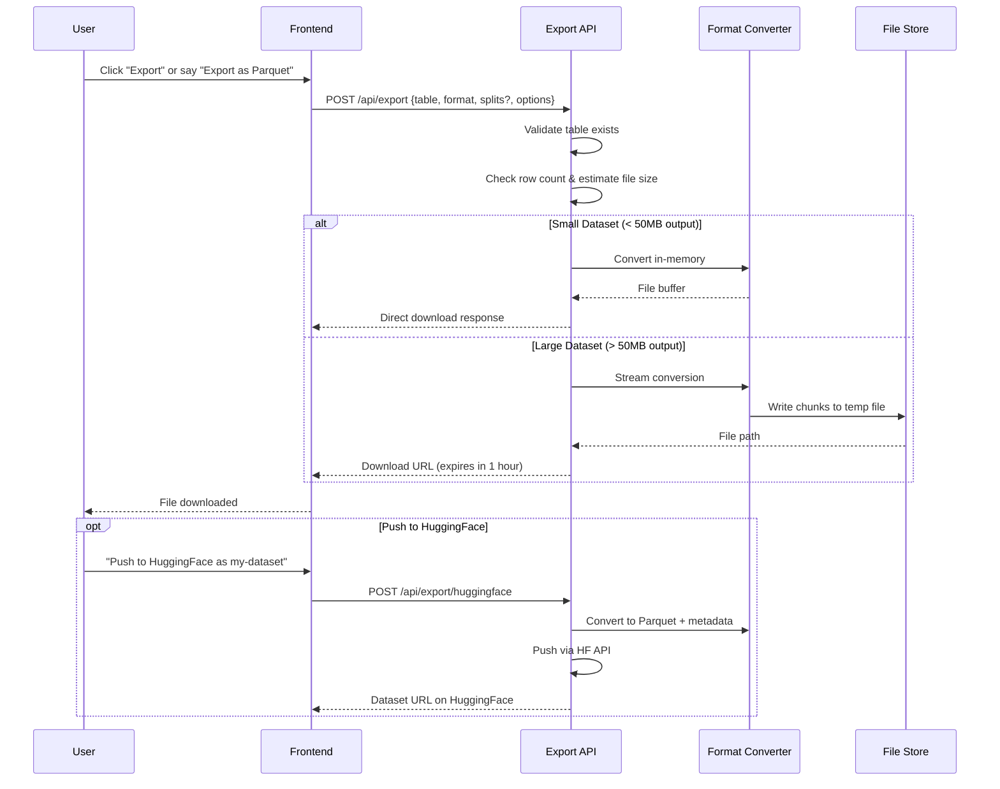

#### Export Options

```typescript
interface ExportOptions {
  format: 'csv' | 'parquet' | 'json' | 'jsonl' | 'arrow' | 'sqlite';
  table: string;
  columns?: string[];           // Subset of columns (default: all)
  splits?: {                    // If dataset was split
    includeTrain: boolean;
    includeVal: boolean;
    includeTest: boolean;
    separateFiles: boolean;     // One file per split or single file with split column
  };
  compression?: 'none' | 'gzip' | 'snappy' | 'zstd';  // For Parquet
  includeMetadata?: boolean;    // Include profiling + transform history
  maxRows?: number;             // Limit output rows
  sampling?: {                  // Random sample instead of full export
    enabled: boolean;
    size: number;
    seed: number;
  };
}
```

**Acceptance Criteria:**
- [ ] CSV export works for any table up to 1M rows
- [ ] Parquet export preserves column types correctly
- [ ] Export includes optional metadata file (schema, profile, transform history)
- [ ] Large exports (>50MB) don't crash the browser — use streaming
- [ ] HuggingFace push creates a valid dataset with card and splits
- [ ] Export button is accessible from both chat and UI toolbar

---

### F8: Dataset Versioning & Snapshots

**Priority:** P2 (Nice to Have)
**Effort:** Medium

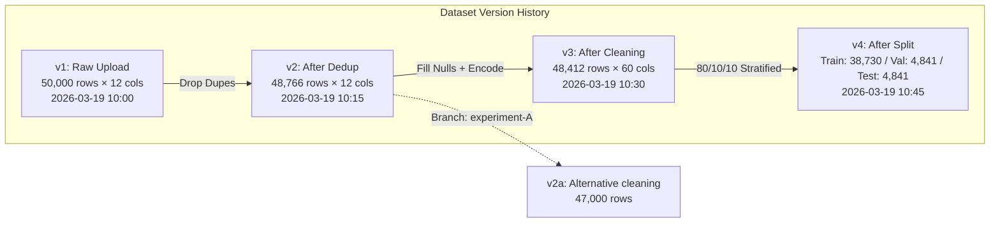

**Acceptance Criteria:**
- [ ] Each transform pipeline execution creates a new version
- [ ] User can compare any two versions (row count, column diff, sample diff)
- [ ] User can revert to any previous version
- [ ] Versions are stored efficiently (pipeline steps, not full copies)
- [ ] Version metadata includes: who, when, what changed, why (from chat context)

---

## 6. User Flows

### Flow 1: Upload → Explore → Clean → Export (Primary)

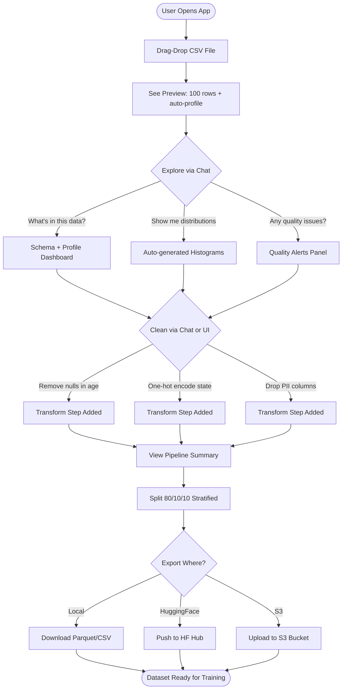

### Flow 2: Connect External DB → Subset → Export

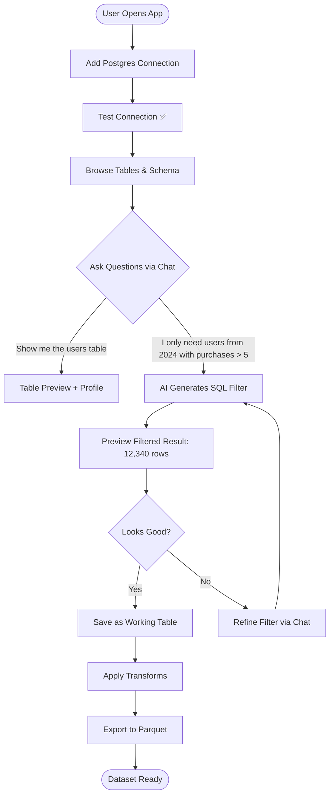

---

## 7. Data Pipeline Architecture

### Processing Model

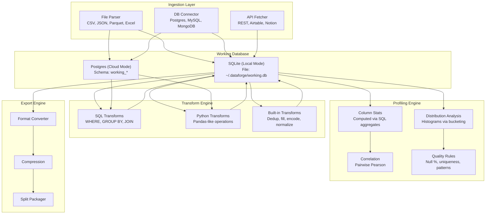

---

## 8. API Design

### New Endpoints

#### `POST /api/upload`

```typescript
// Request: multipart/form-data
{
  file: File,
  tableName?: string,          // Optional custom name
  options?: {
    delimiter?: string,        // CSV delimiter override
    hasHeader?: boolean,       // Default: true
    encoding?: string,         // Default: utf-8
    sheetName?: string,        // For Excel files
  }
}

// Response
{
  success: true,
  table: {
    name: string,
    rowCount: number,
    columns: Array<{
      name: string,
      type: string,
      nullCount: number,
      sampleValues: unknown[]
    }>
  },
  profile: ProfileSummary      // Auto-generated profile
}
```

#### `POST /api/profile`

```typescript
// Request
{
  table: string,
  columns?: string[],          // Specific columns (default: all)
  sampleSize?: number,         // For large tables (default: 100000)
}

// Response
{
  table: string,
  rowCount: number,
  duplicateCount: number,
  columns: Array<ColumnProfile>,
  correlations?: CorrelationMatrix,
  alerts: QualityAlert[],
  profiledAt: string,
  sampledFrom?: number         // If sampling was used
}
```

#### `POST /api/transform`

```typescript
// Request
{
  pipelineId?: string,         // Existing pipeline to extend
  sourceTable: string,
  steps: TransformStep[],
  preview?: boolean,           // If true, return preview without saving
  previewRows?: number         // Default: 100
}

// Response
{
  pipelineId: string,
  resultTable: string,
  steps: Array<{
    ...TransformStep,
    inputRowCount: number,
    outputRowCount: number,
    executionTimeMs: number
  }>,
  preview?: {
    rows: Record<string, unknown>[],
    columns: string[]
  }
}
```

#### `POST /api/split`

```typescript
// Request
{
  table: string,
  strategy: 'random' | 'stratified' | 'temporal' | 'group' | 'kfold',
  ratios: { train: number, val: number, test: number },
  stratifyColumn?: string,
  groupColumn?: string,
  timeColumn?: string,
  seed?: number,               // Default: 42
  kFolds?: number              // For kfold strategy
}

// Response
{
  splits: {
    train: { rowCount: number, table: string },
    val: { rowCount: number, table: string },
    test: { rowCount: number, table: string }
  },
  metadata: {
    strategy: string,
    seed: number,
    distribution?: Record<string, Record<string, number>>  // For stratified
  }
}
```

#### `POST /api/export`

```typescript
// Request
{
  table: string,
  format: 'csv' | 'parquet' | 'json' | 'jsonl' | 'arrow' | 'sqlite',
  columns?: string[],
  compression?: 'none' | 'gzip' | 'snappy' | 'zstd',
  includeMetadata?: boolean,
  splits?: string[],           // ['train', 'val', 'test']
  maxRows?: number
}

// Response: File download stream
// Headers:
//   Content-Type: application/octet-stream
//   Content-Disposition: attachment; filename="dataset.parquet"
//   X-Row-Count: 48412
//   X-Export-Format: parquet
```

#### `POST /api/connector`

```typescript
// Request
{
  action: 'add' | 'remove' | 'test' | 'list',
  connector?: {
    type: 'postgres' | 'mysql' | 'mongodb' | 'bigquery' | 'supabase',
    name: string,
    config: ConnectionConfig
  },
  connectorId?: string         // For remove/test
}

// Response
{
  connectors: Array<{
    id: string,
    name: string,
    type: string,
    status: 'connected' | 'disconnected' | 'error',
    tables: number,
    lastUsed: string
  }>
}
```

---

## 9. UI/UX Specifications

### Layout Architecture

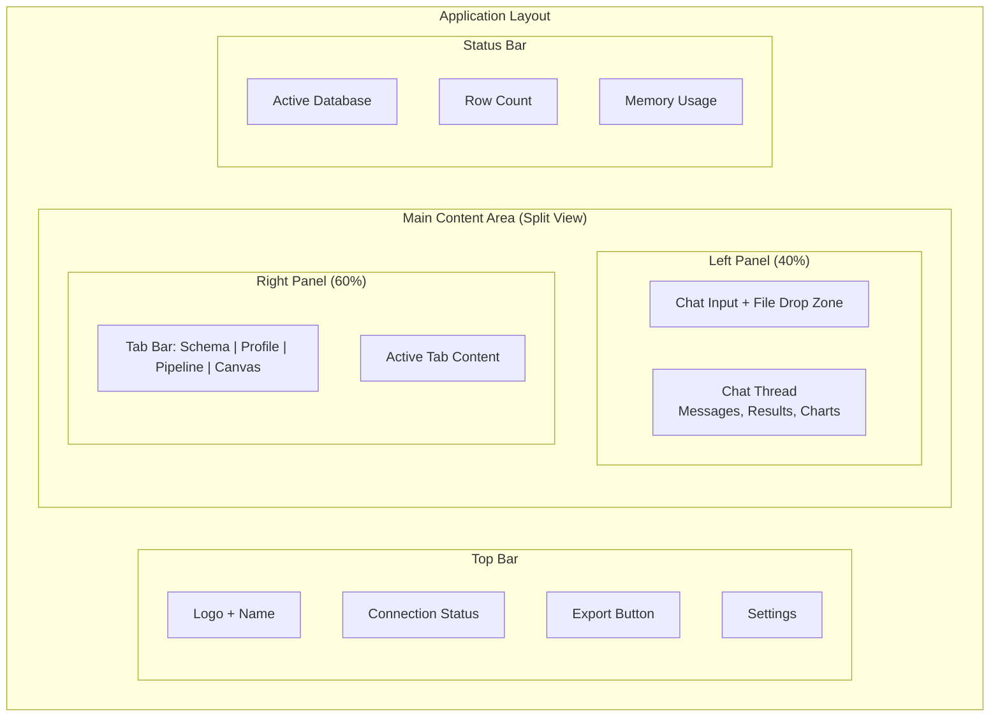

### Key UI Components to Build

| Component | Description | Priority |
|---|---|---|
| `FileDropZone` | Drag-drop area with format icons and progress bar | P0 |
| `ProfileDashboard` | Grid of column profile cards with alerts | P0 |
| `ColumnProfileCard` | Individual column stats + mini chart | P0 |
| `CorrelationHeatmap` | Interactive correlation matrix | P1 |
| `TransformPipelineView` | Visual step-by-step pipeline with row counts | P0 |
| `TransformStepEditor` | Form for configuring a transform step | P0 |
| `SplitConfigurator` | Split strategy selector with preview | P1 |
| `ExportDialog` | Format selector, options, download button | P0 |
| `ConnectorForm` | Database connection form with test button | P0 |
| `ConnectorList` | Saved connections with status indicators | P0 |
| `DataPreviewTable` | Sortable, filterable data table with type badges | P0 |
| `QualityAlertBanner` | Dismissible alerts for data quality issues | P1 |

---

## 10. Technical Requirements

### Dependencies to Add

```json
{
  "dependencies": {
    "mysql2": "^3.x",
    "mongodb": "^6.x",
    "@google-cloud/bigquery": "^7.x",
    "@supabase/supabase-js": "^2.x",
    "papaparse": "^5.x",
    "parquetjs-lite": "^1.x",
    "apache-arrow": "^17.x",
    "xlsx": "^0.18.x",
    "simple-statistics": "^7.x",
    "multer": "^1.x"
  }
}
```

### File Structure (New)

```
src/
├── app/api/
│   ├── upload/route.ts          # File upload endpoint
│   ├── profile/route.ts         # Data profiling endpoint
│   ├── transform/route.ts       # Transform pipeline endpoint
│   ├── split/route.ts           # Dataset split endpoint
│   ├── export/route.ts          # Export/download endpoint
│   └── connector/route.ts       # DB connector management
├── lib/
│   ├── connectors/
│   │   ├── interface.ts         # DatabaseConnector interface
│   │   ├── manager.ts           # ConnectionManager
│   │   ├── postgres.ts          # PostgresConnector
│   │   ├── mysql.ts             # MySQLConnector
│   │   ├── mongodb.ts           # MongoConnector
│   │   ├── bigquery.ts          # BigQueryConnector
│   │   └── sqlite.ts            # SQLiteConnector (refactored)
│   ├── profiling/
│   │   ├── profiler.ts          # Main profiling engine
│   │   ├── column-stats.ts      # Per-column statistics
│   │   ├── correlations.ts      # Correlation matrix
│   │   ├── quality-rules.ts     # Data quality checks
│   │   └── types.ts             # Profile types
│   ├── transforms/
│   │   ├── pipeline.ts          # Pipeline executor
│   │   ├── steps/
│   │   │   ├── filter.ts
│   │   │   ├── dedup.ts
│   │   │   ├── fill-nulls.ts
│   │   │   ├── encode.ts
│   │   │   ├── normalize.ts
│   │   │   ├── rename.ts
│   │   │   ├── cast.ts
│   │   │   ├── drop.ts
│   │   │   ├── computed.ts
│   │   │   └── join.ts
│   │   └── types.ts
│   ├── splitting/
│   │   ├── splitter.ts          # Split logic
│   │   ├── strategies.ts        # Split strategies
│   │   └── types.ts
│   ├── export/
│   │   ├── exporter.ts          # Export engine
│   │   ├── formats/
│   │   │   ├── csv.ts
│   │   │   ├── parquet.ts
│   │   │   ├── json.ts
│   │   │   ├── arrow.ts
│   │   │   └── huggingface.ts
│   │   └── types.ts
│   └── ingestion/
│       ├── file-parser.ts       # File format detection + parsing
│       ├── type-inference.ts    # Column type inference
│       └── types.ts
├── components/
│   ├── data/
│   │   ├── file-drop-zone.tsx
│   │   ├── data-preview-table.tsx
│   │   ├── profile-dashboard.tsx
│   │   ├── column-profile-card.tsx
│   │   ├── correlation-heatmap.tsx
│   │   ├── quality-alert-banner.tsx
│   │   ├── transform-pipeline-view.tsx
│   │   ├── transform-step-editor.tsx
│   │   ├── split-configurator.tsx
│   │   ├── export-dialog.tsx
│   │   ├── connector-form.tsx
│   │   └── connector-list.tsx
│   └── ...
```

---

## 11. Database Schema

### Application Metadata Tables

```sql
-- Track uploaded datasets
CREATE TABLE datasets (
    id TEXT PRIMARY KEY,
    name TEXT NOT NULL,
    source_type TEXT NOT NULL,        -- 'upload', 'connector', 'transform'
    source_id TEXT,                   -- connector_id or parent dataset_id
    table_name TEXT NOT NULL,         -- actual table name in working DB
    row_count INTEGER,
    column_count INTEGER,
    file_size_bytes INTEGER,
    created_at TEXT NOT NULL,
    updated_at TEXT NOT NULL
);

-- Track database connections
CREATE TABLE connectors (
    id TEXT PRIMARY KEY,
    name TEXT NOT NULL,
    type TEXT NOT NULL,               -- 'postgres', 'mysql', 'mongodb', etc.
    config_encrypted TEXT NOT NULL,   -- Encrypted connection config
    status TEXT DEFAULT 'disconnected',
    last_tested_at TEXT,
    created_at TEXT NOT NULL
);

-- Track transform pipelines
CREATE TABLE pipelines (
    id TEXT PRIMARY KEY,
    name TEXT,
    source_dataset_id TEXT NOT NULL,
    result_dataset_id TEXT,
    steps_json TEXT NOT NULL,         -- JSON array of TransformStep
    status TEXT DEFAULT 'draft',      -- 'draft', 'executed', 'failed'
    created_at TEXT NOT NULL,
    executed_at TEXT,
    FOREIGN KEY (source_dataset_id) REFERENCES datasets(id)
);

-- Track data profiles (cached)
CREATE TABLE profiles (
    id TEXT PRIMARY KEY,
    dataset_id TEXT NOT NULL,
    profile_json TEXT NOT NULL,       -- Full profile report
    sampled_from INTEGER,
    created_at TEXT NOT NULL,
    FOREIGN KEY (dataset_id) REFERENCES datasets(id)
);

-- Track exports
CREATE TABLE exports (
    id TEXT PRIMARY KEY,
    dataset_id TEXT NOT NULL,
    format TEXT NOT NULL,
    options_json TEXT,
    file_path TEXT,
    file_size_bytes INTEGER,
    row_count INTEGER,
    created_at TEXT NOT NULL,
    expires_at TEXT,
    FOREIGN KEY (dataset_id) REFERENCES datasets(id)
);

-- Track dataset versions
CREATE TABLE dataset_versions (
    id TEXT PRIMARY KEY,
    dataset_id TEXT NOT NULL,
    version_number INTEGER NOT NULL,
    pipeline_id TEXT,
    row_count INTEGER,
    column_count INTEGER,
    snapshot_table TEXT,              -- Table name of this version's data
    created_at TEXT NOT NULL,
    FOREIGN KEY (dataset_id) REFERENCES datasets(id),
    FOREIGN KEY (pipeline_id) REFERENCES pipelines(id)
);
```

---

## 12. Security & Privacy

### Threat Model

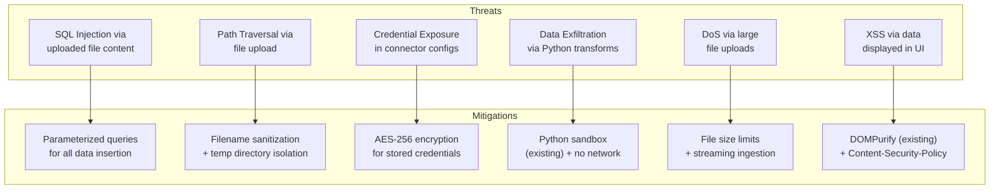

### Data Privacy Considerations

- **PII Detection:** Auto-detect columns that look like emails, phones, SSNs, names
- **PII Alerts:** Warn users before exporting datasets containing PII
- **PII Removal:** One-click "Remove PII columns" transform
- **Local-First:** Default to local SQLite — no data leaves the machine unless user explicitly exports
- **No Telemetry on Data:** Never log or transmit user data content

---

## 13. Performance Requirements

| Operation | Target | Max Dataset Size |
|---|---|---|
| File upload (CSV) | < 5s for 100MB file | 500MB |
| Type inference | < 2s for 1M rows | 1M rows |
| Full profile | < 5s for 100k rows | 1M rows (sampled) |
| Single transform step | < 3s for 100k rows | 1M rows |
| Full pipeline (10 steps) | < 30s for 100k rows | 1M rows |
| Dataset split | < 5s for 100k rows | 1M rows |
| CSV export | < 10s for 1M rows | 5M rows |
| Parquet export | < 15s for 1M rows | 5M rows |
| Chat response (first token) | < 1s | — |

---

## 14. Success Metrics

### North Star Metric
**Datasets exported per week** — this means users completed the full flow.

### Supporting Metrics

| Metric | Target (Month 1) | Target (Month 6) |
|---|---|---|
| GitHub stars | 100 | 1,000 |
| Weekly active users | 20 | 500 |
| Datasets uploaded/week | 50 | 2,000 |
| Datasets exported/week | 20 | 1,000 |
| Avg transforms per pipeline | 3 | 5 |
| HuggingFace pushes/week | 5 | 200 |
| Avg session duration | 10 min | 15 min |
| Return rate (week over week) | 30% | 50% |

---

## 15. Milestones & Phasing

### Phase 1A: Foundation (Weeks 1-3)

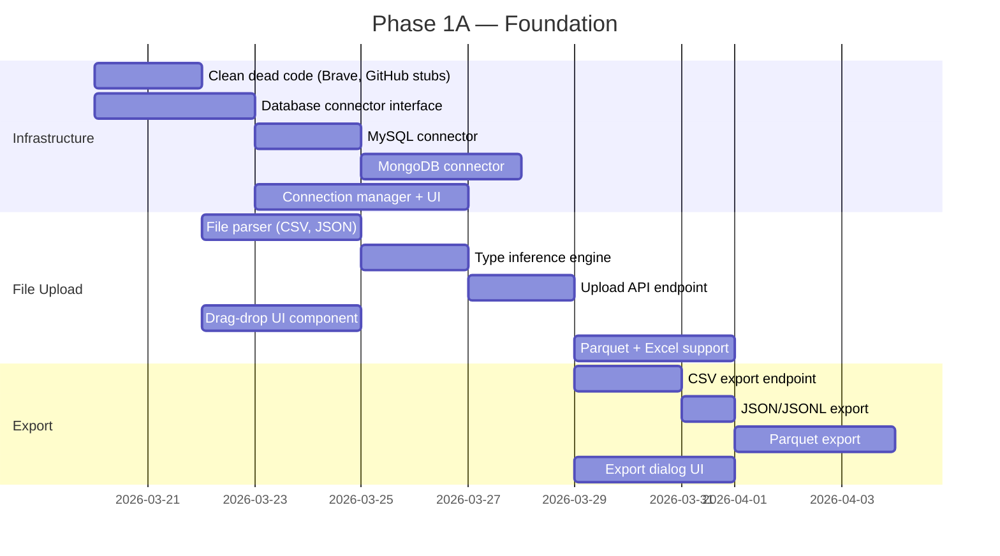

### Phase 1B: Data Prep Core (Weeks 4-7)

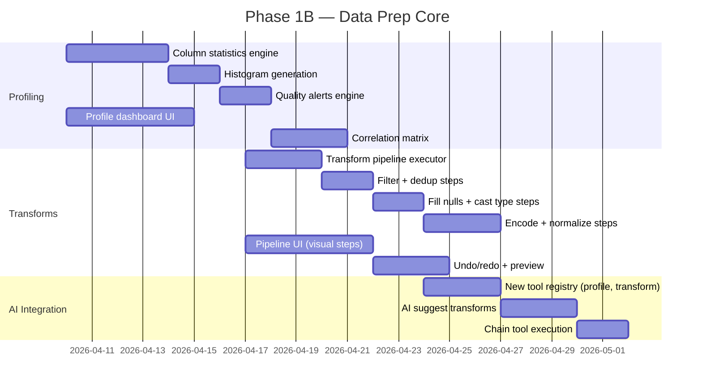

### Phase 1C: ML-Ready Features (Weeks 8-10)

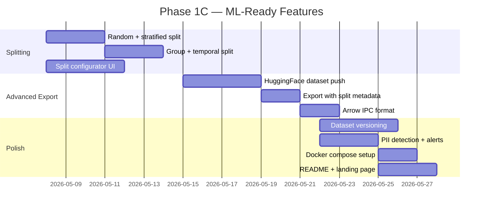

---

## 16. Open Questions & Risks

### Open Questions

| # | Question | Impact | Decision Needed By |
|---|---|---|---|
| 1 | Should we use DuckDB instead of SQLite for the working database? DuckDB is columnar and faster for analytics. | Architecture | Phase 1A start |
| 2 | Should transforms execute as SQL or Python or both? SQL is faster but less flexible. | Transform engine design | Phase 1B start |
| 3 | Do we support real-time sync with source databases or only snapshot? | Connector design | Phase 1A |
| 4 | Should we build a VS Code extension for Jupyter-like inline experience? | Distribution strategy | Post-Phase 1 |
| 5 | How do we handle datasets that don't fit in memory? Streaming? DuckDB? | Performance | Phase 1B |

### Risks

| Risk | Likelihood | Impact | Mitigation |
|---|---|---|---|
| Performance degrades with large files (>100MB) | High | High | Use streaming + DuckDB for analytics |
| Too many connector types to maintain | Medium | Medium | Start with 3, add based on user demand |
| Python sandbox escape | Low | Critical | Keep existing sandbox, add wasm option |
| No differentiation from Pandas in Jupyter | Medium | High | Focus on UX: chat-driven, visual pipeline |
| Scope creep into full BI tool | High | High | Strict PRD adherence, say no to dashboards |

---

*End of PRD — Option A*
