# PRD: Option B — Instant DB Explorer for Non-Technical Teams

> **Product Name:** DataForge Teams (working title)
> **Tagline:** "Your entire team can query your database — no SQL required."
> **Version:** 1.0
> **Date:** 2026-03-19
> **Author:** Kartik Garg

---

## Table of Contents

1. [Problem Statement](#1-problem-statement)
2. [Target Users](#2-target-users)
3. [Product Vision](#3-product-vision)
4. [System Architecture](#4-system-architecture)
5. [Feature Breakdown](#5-feature-breakdown)
6. [User Flows](#6-user-flows)
7. [Multi-Tenancy Architecture](#7-multi-tenancy-architecture)
8. [API Design](#8-api-design)
9. [UI/UX Specifications](#9-uiux-specifications)
10. [Technical Requirements](#10-technical-requirements)
11. [Database Schema](#11-database-schema)
12. [Security & Access Control](#12-security--access-control)
13. [Performance Requirements](#13-performance-requirements)
14. [Success Metrics](#14-success-metrics)
15. [Milestones & Phasing](#15-milestones--phasing)
16. [Open Questions & Risks](#16-open-questions--risks)

---

## 1. Problem Statement

Non-technical team members (PMs, marketers, ops, founders) need data from the company database constantly. Today, they:

1. **Ask an engineer** → "Can you pull users who signed up last week?" → Wait hours/days
2. **Use Metabase/Looker** → Powerful but complex. Most team members only use 5% of features
3. **Get a CSV emailed** → Stale immediately, no follow-up questions possible
4. **Use spreadsheets** → Manual copy-paste, no live connection, version chaos

### The Gap

| Tool | Problem |
|------|---------|
| **Metabase** | 200+ config options, SQL mode intimidates non-technical users |
| **Looker** | $50k+/year, 3-month implementation, needs a "Looker admin" |
| **Tableau** | Desktop-first, expensive, steep learning curve |
| **Power BI** | Microsoft ecosystem lock-in, DAX is its own language |
| **Retool** | For building internal tools, not for ad-hoc questions |
| **ChatGPT + SQL** | No database connection, copy-paste workflow, no sharing |

**The market needs a tool that is as simple as asking a question in Slack, but connected to your real database with real-time results.**

---

## 2. Target Users

### Primary: Non-Technical Knowledge Workers

- **Roles:** Product managers, marketing leads, ops managers, customer success, founders
- **Team size:** 5-50 person startups and scaleups
- **Technical ability:** Can use spreadsheets, cannot write SQL
- **Pain:** Blocked on engineers for every data question
- **Current workaround:** Slack the data team, wait, get a CSV
- **Willingness to pay:** $15-25/user/month (team plans)

### Secondary: Data-Literate Team Leads

- **Roles:** Analytics managers, growth leads, senior PMs
- **Technical ability:** Can write basic SQL, comfortable with Metabase
- **Pain:** Spend time answering data questions from team instead of analysis
- **Value:** Set up dashboards that the rest of the team can self-serve from

### Admin/Setup: Engineers & Data Teams

- **Role:** Set up connections, permissions, and saved queries
- **Pain:** Constant "can you pull X" interrupts
- **Value:** Self-serve data access reduces their interrupt load

### Anti-Personas (NOT building for)

- Data engineers building ETL pipelines
- ML engineers (that's Option A)
- Enterprise BI teams with Tableau/Looker budgets
- Developers who prefer SQL clients

---

## 3. Product Vision

### The Core Experience

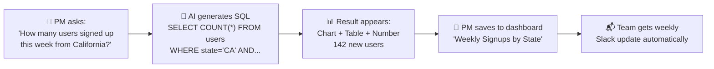
```mermaid
graph LR
    A["🙋 PM asks:<br/>'How many users signed up<br/>this week from California?'"]
    --> B["🤖 AI generates SQL<br/>SELECT COUNT(*) FROM users<br/>WHERE state='CA' AND..."]
    --> C["📊 Result appears:<br/>Chart + Table + Number<br/>142 new users"]
    --> D["📌 PM saves to dashboard<br/>'Weekly Signups by State'"]
    --> E["📬 Team gets weekly<br/>Slack update automatically"]
```

### Product Principles

1. **Chat-first, not dashboard-first** — Every interaction starts with a question
2. **Zero SQL required** — Users never see SQL unless they want to
3. **Shareable by default** — Every answer can become a dashboard widget
4. **Real-time, not stale** — Queries run against live database
5. **Opinionated simplicity** — Fewer features, better experience than Metabase

---

## 4. System Architecture

### Full Technical Architecture

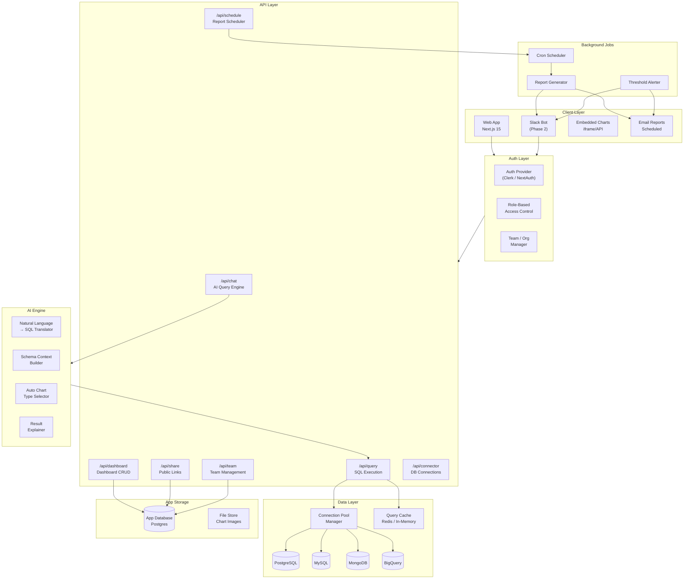
```mermaid
graph TB
    subgraph Clients["Client Layer"]
        Web["Web App<br/>Next.js 15"]
        Slack["Slack Bot<br/>(Phase 2)"]
        Embed["Embedded Charts<br/>iframe/API"]
        Email["Email Reports<br/>Scheduled"]
    end

    subgraph Auth["Auth Layer"]
        Clerk["Auth Provider<br/>(Clerk / NextAuth)"]
        RBAC["Role-Based<br/>Access Control"]
        TeamMgr["Team / Org<br/>Manager"]
    end

    subgraph API["API Layer"]
        Chat["/api/chat<br/>AI Query Engine"]
        Query["/api/query<br/>SQL Execution"]
        Dashboard["/api/dashboard<br/>Dashboard CRUD"]
        Schedule["/api/schedule<br/>Report Scheduler"]
        Share["/api/share<br/>Public Links"]
        Team["/api/team<br/>Team Management"]
        Connector["/api/connector<br/>DB Connections"]
    end

    subgraph AI["AI Engine"]
        NLtoSQL["Natural Language<br/>→ SQL Translator"]
        SchemaCtx["Schema Context<br/>Builder"]
        ChartPicker["Auto Chart<br/>Type Selector"]
        Explainer["Result<br/>Explainer"]
    end

    subgraph Data["Data Layer"]
        ConnPool["Connection Pool<br/>Manager"]
        PG[(PostgreSQL)]
        MY[(MySQL)]
        MG[(MongoDB)]
        BQ[(BigQuery)]
        Cache["Query Cache<br/>Redis / In-Memory"]
    end

    subgraph Storage["App Storage"]
        AppDB[(App Database<br/>Postgres)]
        FileStore["File Store<br/>Chart Images"]
    end

    subgraph Jobs["Background Jobs"]
        Scheduler["Cron Scheduler"]
        Reporter["Report Generator"]
        Alerter["Threshold Alerter"]
    end

    Web --> Auth
    Slack --> Auth
    Auth --> API

    Chat --> AI
    AI --> Query
    Query --> ConnPool
    ConnPool --> PG
    ConnPool --> MY
    ConnPool --> MG
    ConnPool --> BQ

    Query --> Cache

    Dashboard --> AppDB
    Schedule --> Scheduler
    Scheduler --> Reporter
    Reporter --> Email
    Reporter --> Slack
    Alerter --> Slack
    Alerter --> Email

    Share --> AppDB
    Team --> AppDB
```

### Request Flow: Natural Language → Result

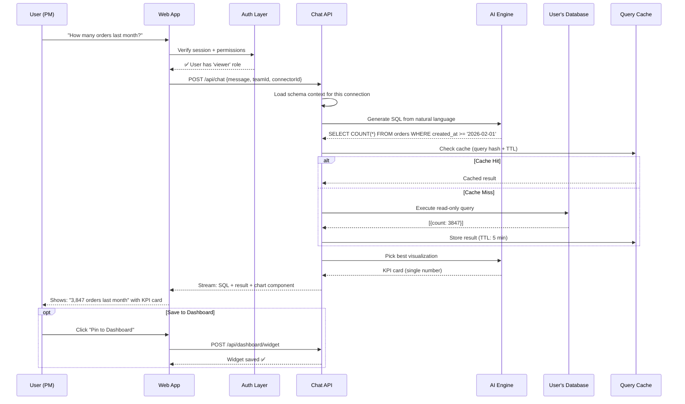
```mermaid
sequenceDiagram
    participant U as User (PM)
    participant UI as Web App
    participant Auth as Auth Layer
    participant API as Chat API
    participant AI as AI Engine
    participant DB as User's Database
    participant Cache as Query Cache

    U->>UI: "How many orders last month?"
    UI->>Auth: Verify session + permissions
    Auth-->>UI: ✅ User has 'viewer' role

    UI->>API: POST /api/chat {message, teamId, connectorId}

    API->>API: Load schema context for this connection
    API->>AI: Generate SQL from natural language
    AI-->>API: SELECT COUNT(*) FROM orders WHERE created_at >= '2026-02-01'

    API->>Cache: Check cache (query hash + TTL)

    alt Cache Hit
        Cache-->>API: Cached result
    else Cache Miss
        API->>DB: Execute read-only query
        DB-->>API: [{count: 3847}]
        API->>Cache: Store result (TTL: 5 min)
    end

    API->>AI: Pick best visualization
    AI-->>API: KPI card (single number)

    API-->>UI: Stream: SQL + result + chart component
    UI-->>U: Shows: "3,847 orders last month" with KPI card

    opt Save to Dashboard
        U->>UI: Click "Pin to Dashboard"
        UI->>API: POST /api/dashboard/widget
        API-->>UI: Widget saved ✅
    end
```

---

## 5. Feature Breakdown

### F1: Authentication & Team Management

**Priority:** P0 (Must Have)
**Effort:** High

#### Role Hierarchy

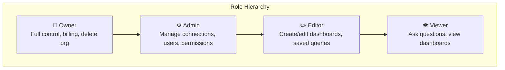
```mermaid
graph TB
    subgraph Roles["Role Hierarchy"]
        Owner["👑 Owner<br/>Full control, billing, delete org"]
        Admin["⚙️ Admin<br/>Manage connections, users, permissions"]
        Editor["✏️ Editor<br/>Create/edit dashboards, saved queries"]
        Viewer["👁️ Viewer<br/>Ask questions, view dashboards"]
    end

    Owner --> Admin
    Admin --> Editor
    Editor --> Viewer
```

#### Permission Matrix

| Action | Owner | Admin | Editor | Viewer |
|---|---|---|---|---|
| Add/remove team members | ✅ | ✅ | ❌ | ❌ |
| Add/edit database connections | ✅ | ✅ | ❌ | ❌ |
| Configure table permissions | ✅ | ✅ | ❌ | ❌ |
| Ask questions (chat) | ✅ | ✅ | ✅ | ✅ |
| View dashboards | ✅ | ✅ | ✅ | ✅ |
| Create/edit dashboards | ✅ | ✅ | ✅ | ❌ |
| Create saved queries | ✅ | ✅ | ✅ | ❌ |
| Share public links | ✅ | ✅ | ✅ | ❌ |
| Schedule reports | ✅ | ✅ | ✅ | ❌ |
| View SQL behind answers | ✅ | ✅ | ✅ | Optional |
| Export results | ✅ | ✅ | ✅ | Optional |
| Delete organization | ✅ | ❌ | ❌ | ❌ |
| Manage billing | ✅ | ❌ | ❌ | ❌ |

#### Auth Implementation

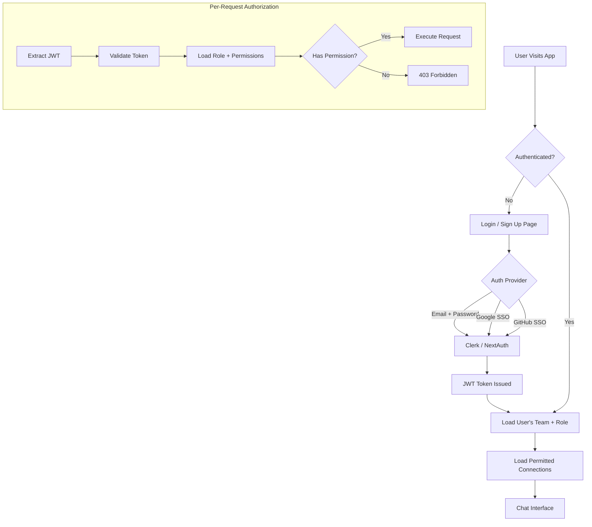
```mermaid
flowchart TB
    A[User Visits App] --> B{Authenticated?}
    B -->|No| C[Login / Sign Up Page]
    C --> D{Auth Provider}
    D -->|Email + Password| E[Clerk / NextAuth]
    D -->|Google SSO| E
    D -->|GitHub SSO| E

    E --> F[JWT Token Issued]
    F --> G[Load User's Team + Role]
    G --> H[Load Permitted Connections]
    H --> I[Chat Interface]

    B -->|Yes| G

    subgraph PerRequest["Per-Request Authorization"]
        R1[Extract JWT] --> R2[Validate Token]
        R2 --> R3[Load Role + Permissions]
        R3 --> R4{Has Permission?}
        R4 -->|Yes| R5[Execute Request]
        R4 -->|No| R6[403 Forbidden]
    end
```

**Acceptance Criteria:**
- [ ] Sign up with email, Google, or GitHub
- [ ] Create a team/org, invite members by email
- [ ] Assign roles: Owner, Admin, Editor, Viewer
- [ ] Role changes take effect immediately (no re-login)
- [ ] Session persists across browser restarts (refresh tokens)
- [ ] SSO works for teams on Google Workspace

---

### F2: AI Query Engine (Natural Language → SQL)

**Priority:** P0 (Must Have)
**Effort:** High

#### How It Works

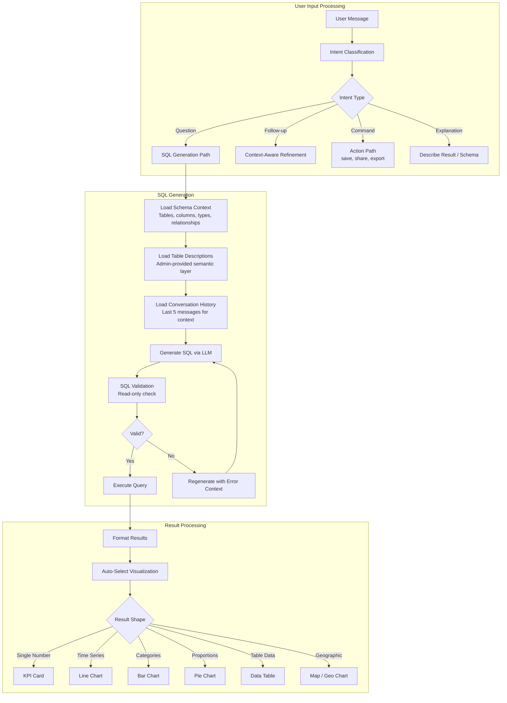
```mermaid
flowchart TB
    subgraph Input["User Input Processing"]
        A[User Message] --> B[Intent Classification]
        B --> C{Intent Type}
        C -->|Question| D[SQL Generation Path]
        C -->|Follow-up| E[Context-Aware Refinement]
        C -->|Command| F[Action Path<br/>save, share, export]
        C -->|Explanation| G[Describe Result / Schema]
    end

    subgraph SQLGen["SQL Generation"]
        D --> H[Load Schema Context<br/>Tables, columns, types, relationships]
        H --> I[Load Table Descriptions<br/>Admin-provided semantic layer]
        I --> J[Load Conversation History<br/>Last 5 messages for context]
        J --> K[Generate SQL via LLM]
        K --> L[SQL Validation<br/>Read-only check]
        L --> M{Valid?}
        M -->|Yes| N[Execute Query]
        M -->|No| O[Regenerate with Error Context]
        O --> K
    end

    subgraph Output["Result Processing"]
        N --> P[Format Results]
        P --> Q[Auto-Select Visualization]
        Q --> R{Result Shape}
        R -->|Single Number| S[KPI Card]
        R -->|Time Series| T[Line Chart]
        R -->|Categories| U[Bar Chart]
        R -->|Proportions| V[Pie Chart]
        R -->|Table Data| W[Data Table]
        R -->|Geographic| X[Map / Geo Chart]
    end
```

#### Semantic Layer (Admin-Configured)

The semantic layer is what makes this tool better than "ChatGPT + a database connection." Admins define:

```typescript
interface SemanticLayer {
  tables: {
    [tableName: string]: {
      description: string;           // "Contains all customer orders"
      businessName?: string;         // "Orders" (friendly name)
      commonQuestions?: string[];     // Pre-configured FAQs
      columns: {
        [columnName: string]: {
          description: string;       // "The date the order was placed"
          businessName?: string;     // "Order Date"
          unit?: string;             // "USD", "days", "count"
          isMetric?: boolean;        // true for "amount", "count"
          isDimension?: boolean;     // true for "category", "region"
          hidden?: boolean;          // Hide from non-admin users
          sensitivityLevel?: 'public' | 'internal' | 'restricted';
        }
      };
      relationships?: {
        table: string;
        type: 'one-to-one' | 'one-to-many' | 'many-to-many';
        joinOn: string;             // "orders.user_id = users.id"
      }[];
    }
  };
  metrics?: {                        // Pre-defined calculated metrics
    [name: string]: {
      sql: string;                   // "SUM(amount) / COUNT(DISTINCT user_id)"
      description: string;
      unit: string;
    }
  };
  synonyms?: {                       // Business term → column mapping
    [term: string]: string;          // "revenue" → "orders.amount"
  };
}
```

#### Visualization Auto-Selection Logic

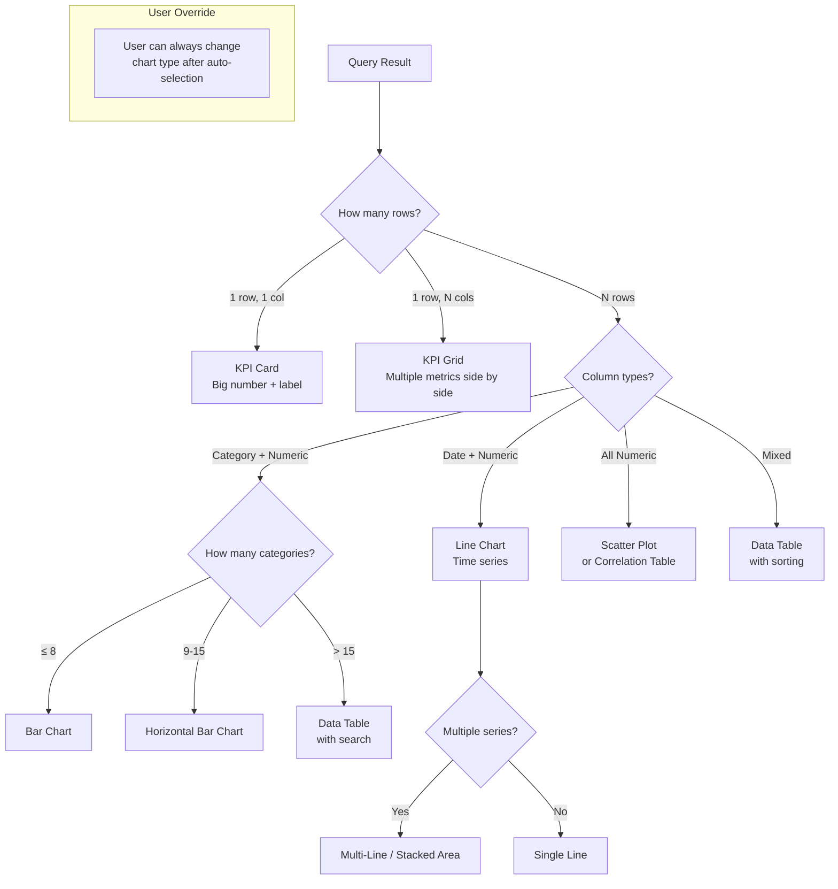
```mermaid
flowchart TB
    A[Query Result] --> B{How many rows?}

    B -->|1 row, 1 col| C[KPI Card<br/>Big number + label]
    B -->|1 row, N cols| D[KPI Grid<br/>Multiple metrics side by side]
    B -->|N rows| E{Column types?}

    E -->|Date + Numeric| F[Line Chart<br/>Time series]
    E -->|Category + Numeric| G{How many categories?}
    E -->|All Numeric| H[Scatter Plot<br/>or Correlation Table]
    E -->|Mixed| I[Data Table<br/>with sorting]

    G -->|≤ 8| J[Bar Chart]
    G -->|9-15| K[Horizontal Bar Chart]
    G -->|> 15| L[Data Table<br/>with search]

    F --> M{Multiple series?}
    M -->|Yes| N[Multi-Line / Stacked Area]
    M -->|No| O[Single Line]

    subgraph Override["User Override"]
        P["User can always change<br/>chart type after auto-selection"]
    end
```

**Acceptance Criteria:**
- [ ] User types "how many users signed up this week" and gets a correct answer in <3 seconds
- [ ] Follow-up questions work: "break that down by country" refines the previous query
- [ ] AI explains what SQL it generated (expandable, hidden by default for viewers)
- [ ] Wrong results can be corrected: "no, I meant active users, not all users"
- [ ] Semantic layer improves accuracy: "revenue" maps to `SUM(orders.amount)` correctly
- [ ] Auto-visualization picks the right chart type >80% of the time
- [ ] User can override chart type with one click

---

### F3: Dashboard System

**Priority:** P0 (Must Have)
**Effort:** High

#### Dashboard Architecture

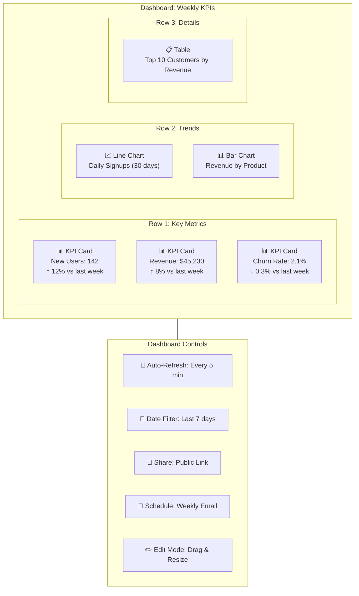
```mermaid
graph TB
    subgraph Dashboard["Dashboard: Weekly KPIs"]
        subgraph Row1["Row 1: Key Metrics"]
            W1["📊 KPI Card<br/>New Users: 142<br/>↑ 12% vs last week"]
            W2["📊 KPI Card<br/>Revenue: $45,230<br/>↑ 8% vs last week"]
            W3["📊 KPI Card<br/>Churn Rate: 2.1%<br/>↓ 0.3% vs last week"]
        end

        subgraph Row2["Row 2: Trends"]
            W4["📈 Line Chart<br/>Daily Signups (30 days)"]
            W5["📊 Bar Chart<br/>Revenue by Product"]
        end

        subgraph Row3["Row 3: Details"]
            W6["📋 Table<br/>Top 10 Customers by Revenue"]
        end
    end

    subgraph Controls["Dashboard Controls"]
        C1["🔄 Auto-Refresh: Every 5 min"]
        C2["📅 Date Filter: Last 7 days"]
        C3["🔗 Share: Public Link"]
        C4["📧 Schedule: Weekly Email"]
        C5["✏️ Edit Mode: Drag & Resize"]
    end

    Dashboard --- Controls
```

#### Widget Types

| Widget | Use Case | Data Shape |
|---|---|---|
| **KPI Card** | Single metric with trend | 1 number + optional comparison |
| **Line Chart** | Trends over time | Date + 1-5 numeric columns |
| **Bar Chart** | Category comparison | Category + numeric |
| **Horizontal Bar** | Ranked lists | Category + numeric (many categories) |
| **Pie / Donut** | Proportions | Category + numeric (≤8 slices) |
| **Area Chart** | Cumulative trends | Date + numeric |
| **Stacked Bar** | Category breakdown over time | Date + category + numeric |
| **Data Table** | Detailed records | Any shape |
| **Scatter Plot** | Correlations | 2 numeric columns |
| **Funnel** | Conversion rates | Ordered stages + counts |
| **Text / Markdown** | Notes, context, headers | Free text |

#### Dashboard Data Model

```typescript
interface Dashboard {
  id: string;
  teamId: string;
  name: string;
  description?: string;
  createdBy: string;              // userId
  layout: DashboardLayout;
  widgets: DashboardWidget[];
  filters: GlobalFilter[];
  refreshInterval?: number;        // seconds (0 = manual only)
  isPublic: boolean;
  publicSlug?: string;             // For shareable URLs
  createdAt: string;
  updatedAt: string;
}

interface DashboardWidget {
  id: string;
  dashboardId: string;
  type: WidgetType;
  title: string;
  query: {
    naturalLanguage: string;       // Original question
    sql: string;                   // Generated SQL
    connectorId: string;           // Which database
  };
  visualization: {
    chartType: ChartType;
    config: ChartConfig;           // Colors, axes, legend, etc.
  };
  position: {
    x: number;                     // Grid column (0-11)
    y: number;                     // Grid row
    w: number;                     // Width in grid units
    h: number;                     // Height in grid units
  };
  refreshOverride?: number;        // Widget-specific refresh
  cachedResult?: {
    data: unknown[];
    fetchedAt: string;
    ttlSeconds: number;
  };
}

interface GlobalFilter {
  id: string;
  name: string;                    // "Date Range", "Region"
  type: 'date_range' | 'select' | 'multi_select' | 'text';
  column: string;                  // Which column this filters
  table: string;                   // Which table
  defaultValue?: unknown;
  linkedWidgets: string[];         // Widget IDs affected
}
```

#### Dashboard Grid System

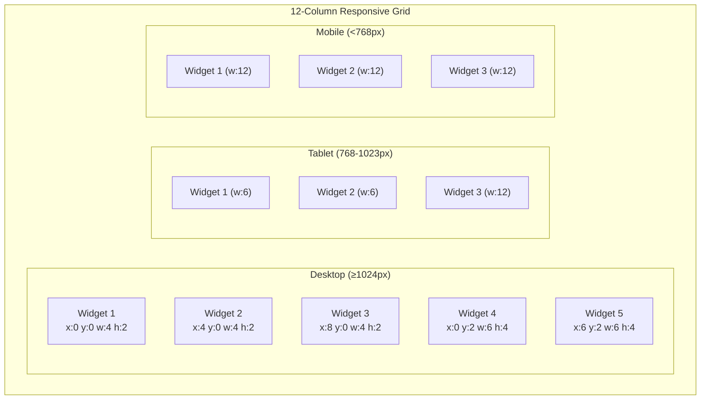
```mermaid
graph TB
    subgraph Grid["12-Column Responsive Grid"]
        subgraph Desktop["Desktop (≥1024px)"]
            D1["Widget 1<br/>x:0 y:0 w:4 h:2"]
            D2["Widget 2<br/>x:4 y:0 w:4 h:2"]
            D3["Widget 3<br/>x:8 y:0 w:4 h:2"]
            D4["Widget 4<br/>x:0 y:2 w:6 h:4"]
            D5["Widget 5<br/>x:6 y:2 w:6 h:4"]
        end

        subgraph Tablet["Tablet (768-1023px)"]
            T1["Widget 1 (w:6)"]
            T2["Widget 2 (w:6)"]
            T3["Widget 3 (w:12)"]
        end

        subgraph Mobile["Mobile (<768px)"]
            M1["Widget 1 (w:12)"]
            M2["Widget 2 (w:12)"]
            M3["Widget 3 (w:12)"]
        end
    end
```

**Acceptance Criteria:**
- [ ] User can create a dashboard and add widgets by asking questions
- [ ] Drag-and-resize widgets on a 12-column grid
- [ ] Global date filter affects all widgets simultaneously
- [ ] Auto-refresh at configurable intervals (1 min to 24 hours)
- [ ] Dashboard loads in <3 seconds with cached data
- [ ] Mobile-responsive layout (single column stack)
- [ ] "Pin to dashboard" works directly from chat conversation

---

### F4: Saved Queries & Query Library

**Priority:** P1 (Should Have)
**Effort:** Medium

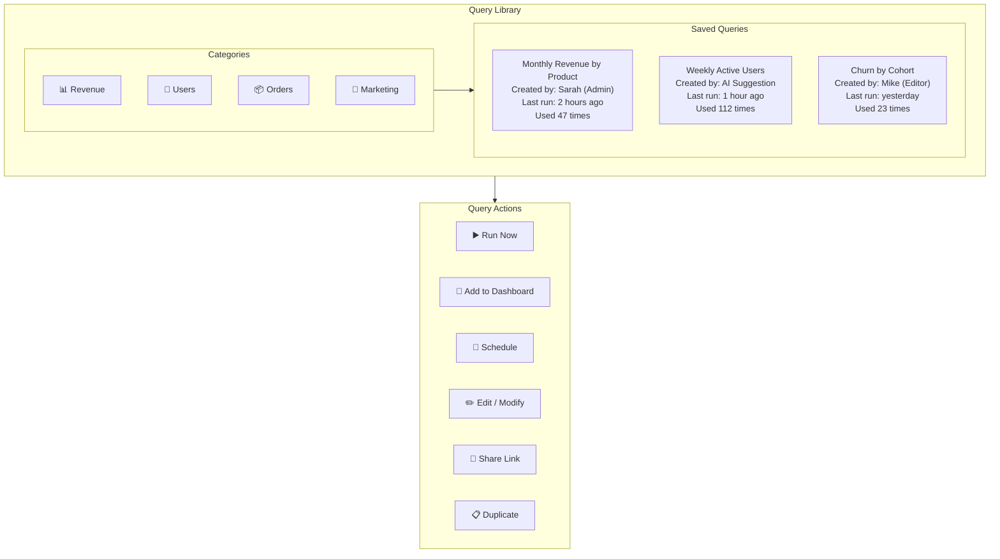
```mermaid
graph TB
    subgraph Library["Query Library"]
        subgraph Categories["Categories"]
            Cat1["📊 Revenue"]
            Cat2["👥 Users"]
            Cat3["📦 Orders"]
            Cat4["🎯 Marketing"]
        end

        subgraph Queries["Saved Queries"]
            Q1["Monthly Revenue by Product<br/>Created by: Sarah (Admin)<br/>Last run: 2 hours ago<br/>Used 47 times"]
            Q2["Weekly Active Users<br/>Created by: AI Suggestion<br/>Last run: 1 hour ago<br/>Used 112 times"]
            Q3["Churn by Cohort<br/>Created by: Mike (Editor)<br/>Last run: yesterday<br/>Used 23 times"]
        end

        Categories --> Queries
    end

    subgraph Actions["Query Actions"]
        A1["▶️ Run Now"]
        A2["📌 Add to Dashboard"]
        A3["📅 Schedule"]
        A4["✏️ Edit / Modify"]
        A5["🔗 Share Link"]
        A6["📋 Duplicate"]
    end

    Library --> Actions
```

#### Saved Query Data Model

```typescript
interface SavedQuery {
  id: string;
  teamId: string;
  name: string;
  description?: string;
  category?: string;
  naturalLanguage: string;        // Original question
  sql: string;                    // Generated SQL
  connectorId: string;
  parameters?: QueryParameter[];  // Parameterized queries
  visualization: {
    chartType: ChartType;
    config: ChartConfig;
  };
  createdBy: string;
  usageCount: number;
  lastRunAt: string;
  isFavorite: boolean;            // Per-user
  tags: string[];
  createdAt: string;
  updatedAt: string;
}

interface QueryParameter {
  name: string;                    // "start_date"
  type: 'date' | 'string' | 'number' | 'select';
  label: string;                   // "Start Date"
  defaultValue?: unknown;
  options?: string[];              // For 'select' type
  required: boolean;
}
```

**Acceptance Criteria:**
- [ ] User can save any chat answer as a saved query with one click
- [ ] Saved queries are browsable by category and searchable
- [ ] Queries support parameters: "Show revenue for {region} in {month}"
- [ ] Most-used queries appear as suggestions in the chat input
- [ ] Saved queries can be added to dashboards directly

---

### F5: Sharing & Public Links

**Priority:** P1 (Should Have)
**Effort:** Medium

#### Sharing Architecture

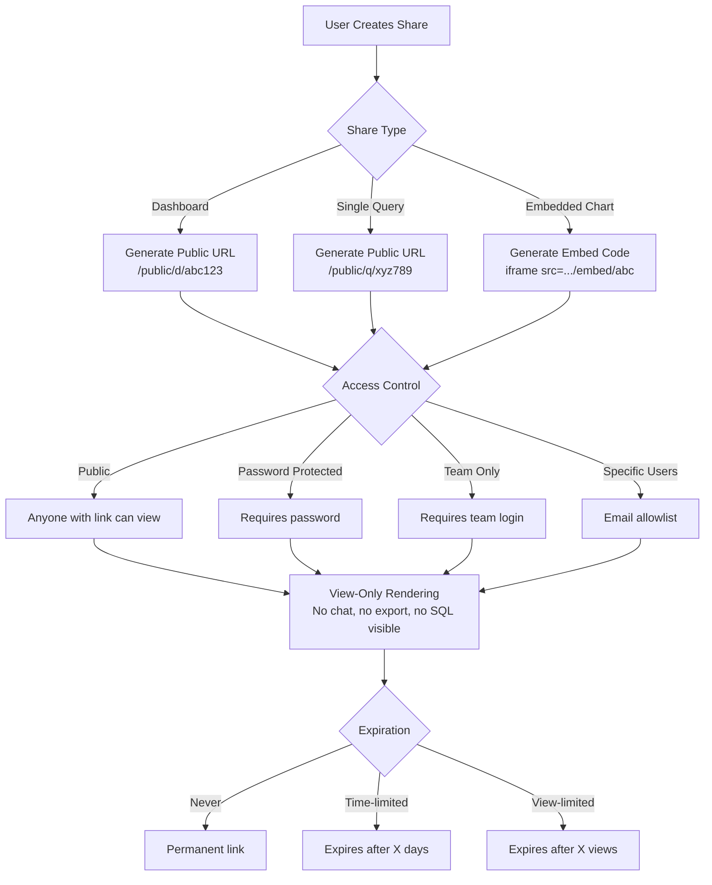
```mermaid
flowchart TB
    A[User Creates Share] --> B{Share Type}

    B -->|Dashboard| C[Generate Public URL<br/>/public/d/abc123]
    B -->|Single Query| D[Generate Public URL<br/>/public/q/xyz789]
    B -->|Embedded Chart| E[Generate Embed Code<br/>iframe src=.../embed/abc]

    C --> F{Access Control}
    D --> F
    E --> F

    F -->|Public| G[Anyone with link can view]
    F -->|Password Protected| H[Requires password]
    F -->|Team Only| I[Requires team login]
    F -->|Specific Users| J[Email allowlist]

    G --> K[View-Only Rendering<br/>No chat, no export, no SQL visible]
    H --> K
    I --> K
    J --> K

    K --> L{Expiration}
    L -->|Never| M[Permanent link]
    L -->|Time-limited| N[Expires after X days]
    L -->|View-limited| O[Expires after X views]
```

#### Embed System

```html
<!-- Basic embed -->
<iframe
  src="https://app.dataforge.dev/embed/widget/abc123"
  width="600"
  height="400"
  frameborder="0"
></iframe>

<!-- With parameters -->
<iframe
  src="https://app.dataforge.dev/embed/widget/abc123?region=US&period=30d"
  width="600"
  height="400"
  frameborder="0"
></iframe>

<!-- Full dashboard embed -->
<iframe
  src="https://app.dataforge.dev/embed/dashboard/xyz789"
  width="100%"
  height="800"
  frameborder="0"
></iframe>
```

**Acceptance Criteria:**
- [ ] One-click share generates a public URL
- [ ] Public views don't expose SQL or raw data (just the visualization)
- [ ] Embedded charts auto-resize to container
- [ ] Password-protected shares work without sign-up
- [ ] Links can be revoked instantly
- [ ] Embeds respect auto-refresh settings

---

### F6: Scheduled Reports & Alerts

**Priority:** P1 (Should Have)
**Effort:** High

#### Scheduling System

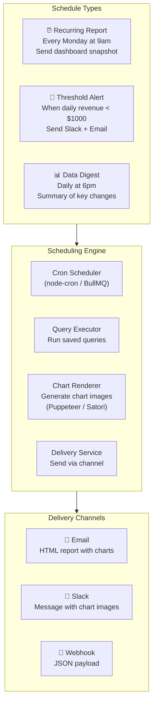
```mermaid
flowchart TB
    subgraph Schedules["Schedule Types"]
        S1["⏰ Recurring Report<br/>Every Monday at 9am<br/>Send dashboard snapshot"]
        S2["🔔 Threshold Alert<br/>When daily revenue < $1000<br/>Send Slack + Email"]
        S3["📊 Data Digest<br/>Daily at 6pm<br/>Summary of key changes"]
    end

    subgraph Channels["Delivery Channels"]
        C1["📧 Email<br/>HTML report with charts"]
        C2["💬 Slack<br/>Message with chart images"]
        C3["🔗 Webhook<br/>JSON payload"]
    end

    subgraph Engine["Scheduling Engine"]
        E1["Cron Scheduler<br/>(node-cron / BullMQ)"]
        E2["Query Executor<br/>Run saved queries"]
        E3["Chart Renderer<br/>Generate chart images<br/>(Puppeteer / Satori)"]
        E4["Delivery Service<br/>Send via channel"]
    end

    Schedules --> Engine
    Engine --> Channels
```

#### Schedule Configuration

```typescript
interface Schedule {
  id: string;
  teamId: string;
  name: string;
  type: 'report' | 'alert' | 'digest';

  // What to send
  source: {
    type: 'dashboard' | 'query' | 'digest';
    dashboardId?: string;
    queryId?: string;
  };

  // When to send
  cron: string;                    // "0 9 * * 1" = every Monday 9am
  timezone: string;                // "America/New_York"

  // Alert-specific
  alert?: {
    condition: 'gt' | 'lt' | 'eq' | 'change_pct';
    threshold: number;
    compareColumn: string;
  };

  // Where to send
  channels: {
    email?: { recipients: string[] };
    slack?: { channelId: string, webhookUrl: string };
    webhook?: { url: string, headers?: Record<string, string> };
  };

  // Status
  enabled: boolean;
  lastRunAt?: string;
  lastStatus?: 'success' | 'failed';
  createdBy: string;
  createdAt: string;
}
```

#### Email Report Template

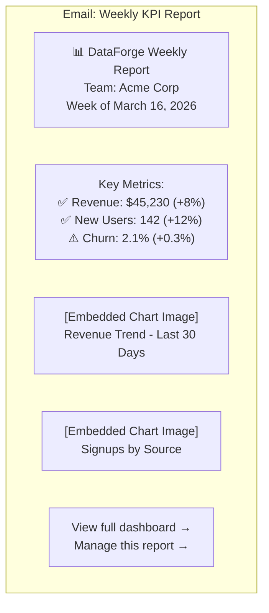
```mermaid
graph TB
    subgraph EmailReport["Email: Weekly KPI Report"]
        Header["📊 DataForge Weekly Report<br/>Team: Acme Corp<br/>Week of March 16, 2026"]

        KPIs["Key Metrics:<br/>✅ Revenue: $45,230 (+8%)<br/>✅ New Users: 142 (+12%)<br/>⚠️ Churn: 2.1% (+0.3%)"]

        Chart1["[Embedded Chart Image]<br/>Revenue Trend - Last 30 Days"]

        Chart2["[Embedded Chart Image]<br/>Signups by Source"]

        Footer["View full dashboard →<br/>Manage this report →"]
    end
```

**Acceptance Criteria:**
- [ ] User can schedule any dashboard to be emailed weekly/daily/monthly
- [ ] Alerts fire when a metric crosses a threshold (e.g., daily revenue < $1000)
- [ ] Slack integration sends chart images (not just text)
- [ ] Email reports include rendered chart images
- [ ] Failed deliveries are retried 3x with exponential backoff
- [ ] User can pause/resume schedules

---

### F7: Slack Bot Integration

**Priority:** P2 (Nice to Have — Phase 2)
**Effort:** High

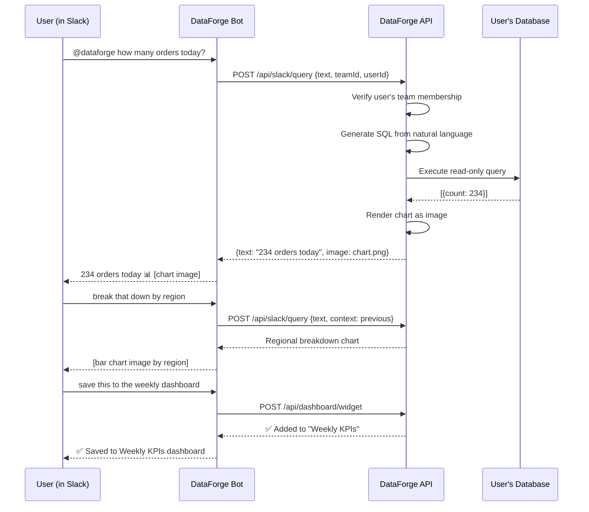
```mermaid
sequenceDiagram
    participant U as User (in Slack)
    participant Bot as DataForge Bot
    participant API as DataForge API
    participant DB as User's Database

    U->>Bot: @dataforge how many orders today?
    Bot->>API: POST /api/slack/query {text, teamId, userId}
    API->>API: Verify user's team membership
    API->>API: Generate SQL from natural language
    API->>DB: Execute read-only query
    DB-->>API: [{count: 234}]
    API->>API: Render chart as image
    API-->>Bot: {text: "234 orders today", image: chart.png}
    Bot-->>U: 234 orders today 📊 [chart image]

    U->>Bot: break that down by region
    Bot->>API: POST /api/slack/query {text, context: previous}
    API-->>Bot: Regional breakdown chart
    Bot-->>U: [bar chart image by region]

    U->>Bot: save this to the weekly dashboard
    Bot->>API: POST /api/dashboard/widget
    API-->>Bot: ✅ Added to "Weekly KPIs"
    Bot-->>U: ✅ Saved to Weekly KPIs dashboard
```

**Acceptance Criteria:**
- [ ] Install Slack app with OAuth
- [ ] @mention the bot in any channel to ask data questions
- [ ] DM the bot for private queries
- [ ] Results include chart images, not just text
- [ ] Follow-up questions maintain context (5-message window)
- [ ] `/dataforge dashboard <name>` posts a dashboard snapshot

---

### F8: Enhanced Visualization Library

**Priority:** P1 (Should Have)
**Effort:** Medium

#### Chart Types to Add

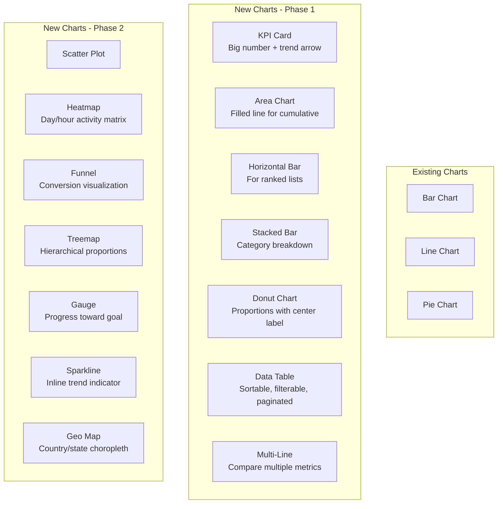
```mermaid
graph TB
    subgraph Existing["Existing Charts"]
        E1[Bar Chart]
        E2[Line Chart]
        E3[Pie Chart]
    end

    subgraph New["New Charts - Phase 1"]
        N1[KPI Card<br/>Big number + trend arrow]
        N2[Area Chart<br/>Filled line for cumulative]
        N3[Horizontal Bar<br/>For ranked lists]
        N4[Stacked Bar<br/>Category breakdown]
        N5[Donut Chart<br/>Proportions with center label]
        N6[Data Table<br/>Sortable, filterable, paginated]
        N7[Multi-Line<br/>Compare multiple metrics]
    end

    subgraph Phase2["New Charts - Phase 2"]
        P1[Scatter Plot]
        P2[Heatmap<br/>Day/hour activity matrix]
        P3[Funnel<br/>Conversion visualization]
        P4[Treemap<br/>Hierarchical proportions]
        P5[Gauge<br/>Progress toward goal]
        P6[Sparkline<br/>Inline trend indicator]
        P7[Geo Map<br/>Country/state choropleth]
    end
```

#### KPI Card Specification (Most Important New Component)

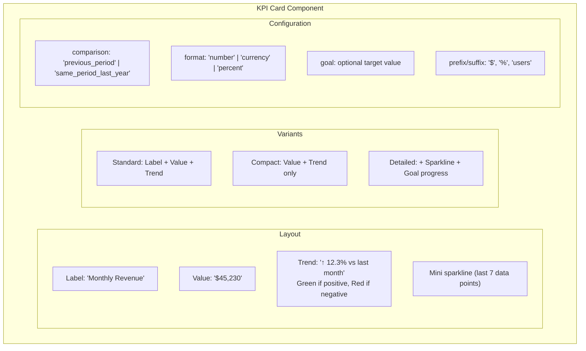
```mermaid
graph TB
    subgraph KPICard["KPI Card Component"]
        subgraph Layout["Layout"]
            Label["Label: 'Monthly Revenue'"]
            Value["Value: '$45,230'"]
            Trend["Trend: '↑ 12.3% vs last month'<br/>Green if positive, Red if negative"]
            Sparkline["Mini sparkline (last 7 data points)"]
        end

        subgraph Variants["Variants"]
            V1["Standard: Label + Value + Trend"]
            V2["Compact: Value + Trend only"]
            V3["Detailed: + Sparkline + Goal progress"]
        end

        subgraph Config["Configuration"]
            C1["comparison: 'previous_period' | 'same_period_last_year'"]
            C2["format: 'number' | 'currency' | 'percent'"]
            C3["goal: optional target value"]
            C4["prefix/suffix: '$', '%', 'users'"]
        end
    end
```

---

### F9: Query Caching & Performance

**Priority:** P1 (Should Have)
**Effort:** Medium

```mermaid
flowchart TB
    A[Query Request] --> B[Generate Cache Key<br/>hash(sql + params + connectorId)]
    B --> C{Cache Hit?}

    C -->|Hit + Fresh| D[Return Cached Result<br/>Add X-Cache: HIT header]

    C -->|Hit + Stale| E{Background Refresh?}
    E -->|Yes| F[Return Stale + Trigger Background Refresh]
    E -->|No| G[Execute Fresh Query]

    C -->|Miss| G

    G --> H[Execute Against Database]
    H --> I[Store in Cache<br/>with TTL based on query type]
    I --> J[Return Fresh Result<br/>Add X-Cache: MISS header]

    subgraph TTLPolicy["Cache TTL Policy"]
        T1["Aggregate queries (COUNT, SUM): 5 min"]
        T2["Dashboard widgets: configurable (1-60 min)"]
        T3["Detail queries (SELECT *): 1 min"]
        T4["Schema queries: 30 min"]
        T5["Scheduled reports: compute fresh, cache 1hr"]
    end
```

#### Cache Storage Options

| Environment | Storage | Max Size | Notes |
|---|---|---|---|
| Local / Self-Hosted | In-Memory (LRU) | 100MB | Default, zero config |
| Cloud / Team | Redis | 1GB | Shared across instances |
| Enterprise | Redis Cluster | 10GB+ | Horizontal scaling |

**Acceptance Criteria:**
- [ ] Repeated identical queries return in <100ms (cache hit)
- [ ] Cache respects TTL — stale data is refreshed
- [ ] Dashboard auto-refresh uses cache-then-refresh pattern
- [ ] Cache can be manually cleared per query or globally
- [ ] Cache size is bounded (LRU eviction)

---

## 6. User Flows

### Flow 1: First-Time Setup (Admin)

```mermaid
flowchart TB
    Start([Admin Signs Up]) --> Create[Create Team: "Acme Corp"]
    Create --> Connect[Add Database Connection<br/>Postgres: production-db.acme.com]
    Connect --> Test[Test Connection ✅]
    Test --> Semantic[Configure Semantic Layer<br/>Describe tables in plain English]

    Semantic --> Permissions["Set Table Permissions<br/>Hide: users.password_hash<br/>Restrict: financial_reports"]

    Permissions --> Invite["Invite Team Members<br/>sarah@acme.com → Editor<br/>mike@acme.com → Viewer"]

    Invite --> FirstQ["Ask First Question<br/>'How many users signed up this week?'"]
    FirstQ --> Save["Save to Dashboard<br/>'Team KPIs'"]
    Save --> Share["Share Dashboard Link<br/>with Team"]
    Share --> Done([Setup Complete<br/>~15 minutes])
```

### Flow 2: Daily Use (Non-Technical User)

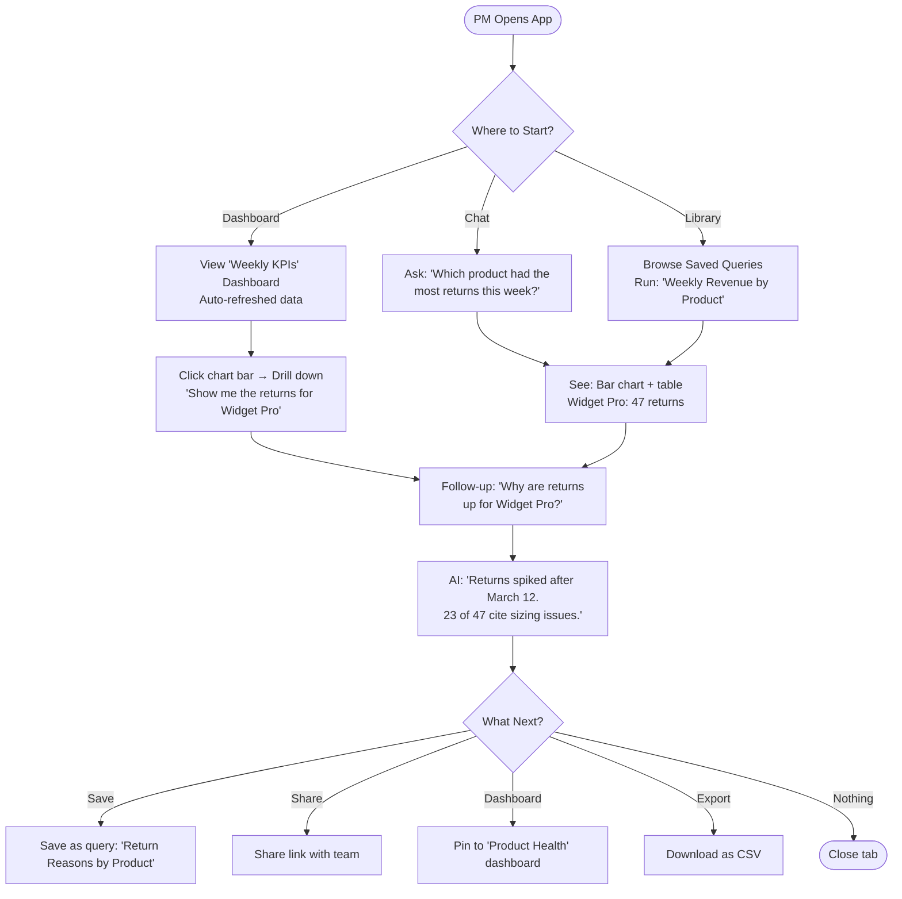
```mermaid
flowchart TB
    Start([PM Opens App]) --> Landing{Where to Start?}

    Landing -->|Dashboard| ViewDash["View 'Weekly KPIs' Dashboard<br/>Auto-refreshed data"]
    Landing -->|Chat| AskQ["Ask: 'Which product had the<br/>most returns this week?'"]
    Landing -->|Library| Browse["Browse Saved Queries<br/>Run: 'Weekly Revenue by Product'"]

    ViewDash --> Drill["Click chart bar → Drill down<br/>'Show me the returns for Widget Pro'"]
    AskQ --> Result["See: Bar chart + table<br/>Widget Pro: 47 returns"]
    Browse --> Result

    Drill --> FollowUp["Follow-up: 'Why are returns<br/>up for Widget Pro?'"]
    Result --> FollowUp

    FollowUp --> Insight["AI: 'Returns spiked after March 12.<br/>23 of 47 cite sizing issues.'"]

    Insight --> Action{What Next?}
    Action -->|Save| SaveQ["Save as query: 'Return Reasons by Product'"]
    Action -->|Share| ShareLink["Share link with team"]
    Action -->|Dashboard| AddWidget["Pin to 'Product Health' dashboard"]
    Action -->|Export| DownloadCSV["Download as CSV"]
    Action -->|Nothing| Done([Close tab])
```

### Flow 3: Scheduled Report (Automated)

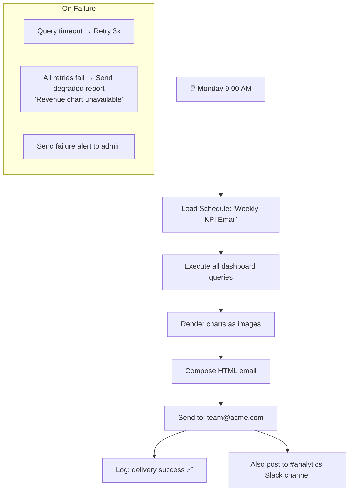
```mermaid
flowchart TB
    Cron["⏰ Monday 9:00 AM"] --> Load["Load Schedule: 'Weekly KPI Email'"]
    Load --> Execute["Execute all dashboard queries"]
    Execute --> Render["Render charts as images"]
    Render --> Compose["Compose HTML email"]
    Compose --> Send["Send to: team@acme.com"]
    Send --> Log["Log: delivery success ✅"]

    Send --> Slack["Also post to #analytics Slack channel"]

    subgraph Failure["On Failure"]
        F1["Query timeout → Retry 3x"]
        F2["All retries fail → Send degraded report<br/>'Revenue chart unavailable'"]
        F3["Send failure alert to admin"]
    end
```

---

## 7. Multi-Tenancy Architecture

### Data Isolation Model

```mermaid
graph TB
    subgraph Tenant1["Team: Acme Corp"]
        T1U1[User: Sarah<br/>Role: Admin]
        T1U2[User: Mike<br/>Role: Viewer]
        T1DB1[(Acme Postgres<br/>production-db)]
        T1DB2[(Acme MySQL<br/>analytics-db)]
        T1D1[Dashboard: KPIs]
        T1D2[Dashboard: Sales]
    end

    subgraph Tenant2["Team: Globex Inc"]
        T2U1[User: Lisa<br/>Role: Owner]
        T2U2[User: Bob<br/>Role: Editor]
        T2DB1[(Globex BigQuery<br/>analytics)]
        T2D1[Dashboard: Marketing]
    end

    subgraph AppDB["Application Database"]
        Teams[teams table]
        Users[users table]
        Connectors[connectors table<br/>team_id FK]
        Dashboards[dashboards table<br/>team_id FK]
        Queries[queries table<br/>team_id FK]
    end

    subgraph Isolation["Isolation Guarantees"]
        I1["✅ Acme users CANNOT see Globex data"]
        I2["✅ Globex queries CANNOT access Acme DB"]
        I3["✅ API key scoped to team_id"]
        I4["✅ Connection credentials encrypted per-team"]
    end

    Tenant1 --> AppDB
    Tenant2 --> AppDB
    AppDB --> Isolation
```

### Row-Level Security Pattern

```typescript
// Every API endpoint wraps queries with team context
async function withTeamContext(
  req: Request,
  handler: (teamId: string, userId: string, role: Role) => Promise<Response>
) {
  const session = await getSession(req);
  if (!session) return unauthorized();

  const { teamId, userId, role } = session;

  // All database queries MUST include team_id filter
  return handler(teamId, userId, role);
}

// Example: Dashboard listing
app.get('/api/dashboards', async (req) => {
  return withTeamContext(req, async (teamId, userId, role) => {
    // Team-scoped query — never leaks cross-tenant data
    const dashboards = await db.query(
      'SELECT * FROM dashboards WHERE team_id = $1',
      [teamId]
    );
    return json(dashboards);
  });
});
```

---

## 8. API Design

### New Endpoints

#### `POST /api/team`

```typescript
// Create team
{ action: 'create', name: string }

// Invite member
{ action: 'invite', email: string, role: Role }

// Update member role
{ action: 'update_role', userId: string, role: Role }

// Remove member
{ action: 'remove', userId: string }

// List members
{ action: 'list' }
```

#### `POST /api/dashboard`

```typescript
// Create dashboard
{
  action: 'create',
  name: string,
  description?: string
}

// Add widget
{
  action: 'add_widget',
  dashboardId: string,
  widget: {
    title: string,
    query: { naturalLanguage: string, sql: string, connectorId: string },
    visualization: { chartType: string, config: object },
    position: { x: number, y: number, w: number, h: number }
  }
}

// Update layout (drag/resize)
{
  action: 'update_layout',
  dashboardId: string,
  widgets: Array<{ id: string, position: { x, y, w, h } }>
}

// Add global filter
{
  action: 'add_filter',
  dashboardId: string,
  filter: GlobalFilter
}

// Response
{
  dashboard: Dashboard  // Full dashboard with widgets
}
```

#### `POST /api/share`

```typescript
// Create share link
{
  action: 'create',
  resourceType: 'dashboard' | 'query',
  resourceId: string,
  access: 'public' | 'password' | 'team' | 'allowlist',
  password?: string,
  allowedEmails?: string[],
  expiresAt?: string
}

// Response
{
  shareId: string,
  url: string,             // https://app.dataforge.dev/public/d/abc123
  embedUrl: string,        // https://app.dataforge.dev/embed/d/abc123
  embedCode: string        // <iframe src="..."></iframe>
}
```

#### `POST /api/schedule`

```typescript
// Create schedule
{
  action: 'create',
  name: string,
  type: 'report' | 'alert',
  source: { type: 'dashboard' | 'query', id: string },
  cron: string,
  timezone: string,
  channels: {
    email?: { recipients: string[] },
    slack?: { webhookUrl: string },
    webhook?: { url: string }
  },
  alert?: {
    condition: 'gt' | 'lt' | 'change_pct',
    threshold: number,
    column: string
  }
}
```

#### `GET /api/public/:type/:id`

```typescript
// Render public dashboard or query result
// No authentication required (or password-only)
// Returns: HTML page with rendered charts (no chat, no SQL, no edit)
```

---

## 9. UI/UX Specifications

### Application Layout

```mermaid
graph TB
    subgraph AppLayout["Application Layout"]
        subgraph Sidebar["Left Sidebar (Collapsible)"]
            Logo["🔷 DataForge"]
            Nav1["💬 Chat"]
            Nav2["📊 Dashboards"]
            Nav3["📚 Query Library"]
            Nav4["🔌 Connections"]
            Nav5["👥 Team"]
            Nav6["⚙️ Settings"]
            TeamSwitcher["Team Switcher (bottom)"]
        end

        subgraph MainContent["Main Content Area"]
            TopBar["Search Bar + New Chat Button"]
            Content["Dynamic Content Area"]
        end
    end
```

### Key Pages

| Page | Route | Description |
|---|---|---|
| Chat | `/chat` | AI query interface |
| Chat Thread | `/chat/:threadId` | Specific conversation |
| Dashboards | `/dashboards` | Dashboard list |
| Dashboard View | `/dashboards/:id` | Single dashboard |
| Dashboard Edit | `/dashboards/:id/edit` | Edit mode (drag/resize) |
| Query Library | `/queries` | Saved queries |
| Connections | `/connections` | Database connections |
| Connection Setup | `/connections/new` | Add new connection |
| Team | `/team` | Team members + roles |
| Settings | `/settings` | App settings, billing |
| Public Dashboard | `/public/d/:slug` | Shared dashboard (no auth) |
| Embedded Widget | `/embed/w/:id` | Embeddable chart |

### Key Components to Build

| Component | Priority | Description |
|---|---|---|
| `AuthGate` | P0 | Login/signup flow with SSO |
| `TeamSwitcher` | P0 | Switch between teams |
| `Sidebar` | P0 | App navigation |
| `DashboardGrid` | P0 | 12-column grid with drag/resize |
| `WidgetRenderer` | P0 | Renders any widget type |
| `KPICard` | P0 | Big number + trend |
| `GlobalFilterBar` | P0 | Date range, select filters |
| `ShareDialog` | P1 | Share link configuration |
| `ScheduleForm` | P1 | Schedule configuration |
| `SemanticLayerEditor` | P1 | Admin tool for table descriptions |
| `ConnectorWizard` | P0 | Step-by-step connection setup |
| `QueryParameterForm` | P1 | Parameter inputs for saved queries |
| `PublicDashboardView` | P1 | Read-only dashboard renderer |
| `EmbedWrapper` | P1 | Minimal frame for embeds |
| `SlackAuthFlow` | P2 | Slack OAuth connection |

---

## 10. Technical Requirements

### Dependencies to Add (Beyond Option A)

```json
{
  "dependencies": {
    "@clerk/nextjs": "^5.x",
    "redis": "^4.x",
    "bullmq": "^5.x",
    "node-cron": "^3.x",
    "nodemailer": "^6.x",
    "@slack/web-api": "^7.x",
    "@slack/bolt": "^4.x",
    "react-grid-layout": "^1.x",
    "puppeteer-core": "^23.x",
    "@nivo/core": "^0.87.x",
    "@nivo/heatmap": "^0.87.x",
    "@nivo/funnel": "^0.87.x",
    "@nivo/geo": "^0.87.x",
    "satori": "^0.12.x",
    "sharp": "^0.33.x"
  }
}
```

### File Structure (New — Option B specific)

```
src/
├── app/
│   ├── (auth)/
│   │   ├── login/page.tsx
│   │   ├── signup/page.tsx
│   │   └── layout.tsx
│   ├── (app)/
│   │   ├── chat/page.tsx                 # Enhanced chat
│   │   ├── dashboards/
│   │   │   ├── page.tsx                  # Dashboard list
│   │   │   ├── [id]/page.tsx             # View dashboard
│   │   │   └── [id]/edit/page.tsx        # Edit dashboard
│   │   ├── queries/page.tsx              # Query library
│   │   ├── connections/
│   │   │   ├── page.tsx                  # Connection list
│   │   │   └── new/page.tsx              # Add connection
│   │   ├── team/page.tsx                 # Team management
│   │   ├── settings/page.tsx             # Settings
│   │   └── layout.tsx                    # App shell with sidebar
│   ├── public/
│   │   ├── d/[slug]/page.tsx             # Public dashboard
│   │   └── q/[slug]/page.tsx             # Public query
│   ├── embed/
│   │   ├── w/[id]/page.tsx               # Embedded widget
│   │   └── d/[id]/page.tsx               # Embedded dashboard
│   └── api/
│       ├── team/route.ts
│       ├── dashboard/route.ts
│       ├── share/route.ts
│       ├── schedule/route.ts
│       ├── slack/
│       │   ├── events/route.ts           # Slack events
│       │   ├── commands/route.ts         # Slack slash commands
│       │   └── oauth/route.ts            # Slack OAuth
│       └── public/
│           └── [type]/[id]/route.ts      # Public data endpoint
├── lib/
│   ├── auth/
│   │   ├── session.ts                    # Session management
│   │   ├── rbac.ts                       # Role-based access control
│   │   └── team-context.ts              # Team scoping middleware
│   ├── dashboard/
│   │   ├── types.ts
│   │   ├── widget-renderer.ts
│   │   └── layout-engine.ts
│   ├── scheduling/
│   │   ├── scheduler.ts                  # Cron job manager
│   │   ├── report-generator.ts           # Chart image generation
│   │   └── delivery.ts                   # Email/Slack/Webhook send
│   ├── sharing/
│   │   ├── share-manager.ts
│   │   └── embed-renderer.ts
│   ├── cache/
│   │   ├── query-cache.ts               # Query result caching
│   │   └── lru.ts                        # In-memory LRU
│   ├── semantic/
│   │   ├── layer.ts                      # Semantic layer engine
│   │   └── nl-to-sql.ts                 # Enhanced NL→SQL with context
│   └── slack/
│       ├── bot.ts                        # Slack bot logic
│       └── chart-renderer.ts            # Chart → image for Slack
├── components/
│   ├── auth/
│   │   ├── auth-gate.tsx
│   │   ├── login-form.tsx
│   │   └── team-switcher.tsx
│   ├── dashboard/
│   │   ├── dashboard-grid.tsx
│   │   ├── widget-renderer.tsx
│   │   ├── widget-types/
│   │   │   ├── kpi-card.tsx
│   │   │   ├── area-chart.tsx
│   │   │   ├── horizontal-bar.tsx
│   │   │   ├── stacked-bar.tsx
│   │   │   ├── donut-chart.tsx
│   │   │   ├── data-table.tsx
│   │   │   ├── scatter-plot.tsx
│   │   │   ├── heatmap.tsx
│   │   │   ├── funnel.tsx
│   │   │   └── gauge.tsx
│   │   ├── global-filter-bar.tsx
│   │   ├── widget-config-panel.tsx
│   │   └── dashboard-toolbar.tsx
│   ├── sharing/
│   │   ├── share-dialog.tsx
│   │   ├── embed-code-panel.tsx
│   │   └── public-dashboard-view.tsx
│   ├── scheduling/
│   │   ├── schedule-form.tsx
│   │   └── schedule-list.tsx
│   ├── semantic/
│   │   ├── semantic-layer-editor.tsx
│   │   └── table-description-form.tsx
│   ├── layout/
│   │   ├── sidebar.tsx
│   │   ├── app-shell.tsx
│   │   └── top-bar.tsx
│   └── ...
```

---

## 11. Database Schema

### Application Database (Postgres)

```sql
-- Teams / Organizations
CREATE TABLE teams (
    id TEXT PRIMARY KEY,
    name TEXT NOT NULL,
    slug TEXT UNIQUE NOT NULL,
    plan TEXT DEFAULT 'free',        -- 'free', 'pro', 'enterprise'
    created_at TIMESTAMPTZ DEFAULT NOW(),
    updated_at TIMESTAMPTZ DEFAULT NOW()
);

-- Team Members
CREATE TABLE team_members (
    id TEXT PRIMARY KEY,
    team_id TEXT NOT NULL REFERENCES teams(id) ON DELETE CASCADE,
    user_id TEXT NOT NULL,            -- From auth provider
    email TEXT NOT NULL,
    name TEXT,
    role TEXT NOT NULL DEFAULT 'viewer',  -- 'owner', 'admin', 'editor', 'viewer'
    invited_by TEXT,
    joined_at TIMESTAMPTZ DEFAULT NOW(),
    UNIQUE(team_id, user_id)
);

-- Database Connections (per team)
CREATE TABLE connectors (
    id TEXT PRIMARY KEY,
    team_id TEXT NOT NULL REFERENCES teams(id) ON DELETE CASCADE,
    name TEXT NOT NULL,
    type TEXT NOT NULL,               -- 'postgres', 'mysql', 'mongodb', 'bigquery'
    config_encrypted TEXT NOT NULL,   -- AES-256 encrypted connection config
    semantic_layer JSONB,            -- Table descriptions, column metadata
    status TEXT DEFAULT 'disconnected',
    last_tested_at TIMESTAMPTZ,
    created_by TEXT NOT NULL,
    created_at TIMESTAMPTZ DEFAULT NOW()
);

-- Table Permissions (per connector)
CREATE TABLE table_permissions (
    id TEXT PRIMARY KEY,
    connector_id TEXT NOT NULL REFERENCES connectors(id) ON DELETE CASCADE,
    table_name TEXT NOT NULL,
    visibility TEXT DEFAULT 'visible',  -- 'visible', 'hidden', 'restricted'
    allowed_roles TEXT[] DEFAULT '{owner,admin,editor,viewer}',
    hidden_columns TEXT[] DEFAULT '{}',
    created_at TIMESTAMPTZ DEFAULT NOW(),
    UNIQUE(connector_id, table_name)
);

-- Dashboards
CREATE TABLE dashboards (
    id TEXT PRIMARY KEY,
    team_id TEXT NOT NULL REFERENCES teams(id) ON DELETE CASCADE,
    name TEXT NOT NULL,
    description TEXT,
    layout JSONB DEFAULT '{}',
    filters JSONB DEFAULT '[]',       -- Global filters config
    refresh_interval INTEGER DEFAULT 0, -- seconds
    is_public BOOLEAN DEFAULT FALSE,
    public_slug TEXT UNIQUE,
    created_by TEXT NOT NULL,
    created_at TIMESTAMPTZ DEFAULT NOW(),
    updated_at TIMESTAMPTZ DEFAULT NOW()
);

-- Dashboard Widgets
CREATE TABLE dashboard_widgets (
    id TEXT PRIMARY KEY,
    dashboard_id TEXT NOT NULL REFERENCES dashboards(id) ON DELETE CASCADE,
    title TEXT NOT NULL,
    widget_type TEXT NOT NULL,        -- 'kpi', 'line', 'bar', 'table', etc.
    query_natural TEXT NOT NULL,      -- Natural language question
    query_sql TEXT NOT NULL,          -- Generated SQL
    connector_id TEXT NOT NULL REFERENCES connectors(id),
    visualization JSONB NOT NULL,    -- Chart config
    position JSONB NOT NULL,         -- {x, y, w, h}
    refresh_override INTEGER,
    sort_order INTEGER DEFAULT 0,
    created_at TIMESTAMPTZ DEFAULT NOW(),
    updated_at TIMESTAMPTZ DEFAULT NOW()
);

-- Saved Queries
CREATE TABLE saved_queries (
    id TEXT PRIMARY KEY,
    team_id TEXT NOT NULL REFERENCES teams(id) ON DELETE CASCADE,
    name TEXT NOT NULL,
    description TEXT,
    category TEXT,
    natural_language TEXT NOT NULL,
    sql TEXT NOT NULL,
    connector_id TEXT NOT NULL REFERENCES connectors(id),
    parameters JSONB DEFAULT '[]',   -- Parameterized query config
    visualization JSONB,
    usage_count INTEGER DEFAULT 0,
    last_run_at TIMESTAMPTZ,
    tags TEXT[] DEFAULT '{}',
    created_by TEXT NOT NULL,
    created_at TIMESTAMPTZ DEFAULT NOW(),
    updated_at TIMESTAMPTZ DEFAULT NOW()
);

-- Query Favorites (per user)
CREATE TABLE query_favorites (
    user_id TEXT NOT NULL,
    query_id TEXT NOT NULL REFERENCES saved_queries(id) ON DELETE CASCADE,
    created_at TIMESTAMPTZ DEFAULT NOW(),
    PRIMARY KEY (user_id, query_id)
);

-- Shared Links
CREATE TABLE shares (
    id TEXT PRIMARY KEY,
    team_id TEXT NOT NULL REFERENCES teams(id) ON DELETE CASCADE,
    resource_type TEXT NOT NULL,      -- 'dashboard', 'query'
    resource_id TEXT NOT NULL,
    slug TEXT UNIQUE NOT NULL,
    access_type TEXT NOT NULL,        -- 'public', 'password', 'team', 'allowlist'
    password_hash TEXT,
    allowed_emails TEXT[],
    expires_at TIMESTAMPTZ,
    max_views INTEGER,
    view_count INTEGER DEFAULT 0,
    created_by TEXT NOT NULL,
    created_at TIMESTAMPTZ DEFAULT NOW()
);

-- Scheduled Reports
CREATE TABLE schedules (
    id TEXT PRIMARY KEY,
    team_id TEXT NOT NULL REFERENCES teams(id) ON DELETE CASCADE,
    name TEXT NOT NULL,
    type TEXT NOT NULL,               -- 'report', 'alert'
    source_type TEXT NOT NULL,        -- 'dashboard', 'query'
    source_id TEXT NOT NULL,
    cron_expression TEXT NOT NULL,
    timezone TEXT NOT NULL DEFAULT 'UTC',
    channels JSONB NOT NULL,         -- {email: {...}, slack: {...}, webhook: {...}}
    alert_config JSONB,              -- For alerts: {condition, threshold, column}
    enabled BOOLEAN DEFAULT TRUE,
    last_run_at TIMESTAMPTZ,
    last_status TEXT,
    next_run_at TIMESTAMPTZ,
    created_by TEXT NOT NULL,
    created_at TIMESTAMPTZ DEFAULT NOW()
);

-- Schedule Run History
CREATE TABLE schedule_runs (
    id TEXT PRIMARY KEY,
    schedule_id TEXT NOT NULL REFERENCES schedules(id) ON DELETE CASCADE,
    status TEXT NOT NULL,             -- 'success', 'failed', 'partial'
    started_at TIMESTAMPTZ NOT NULL,
    completed_at TIMESTAMPTZ,
    error_message TEXT,
    delivery_results JSONB           -- Per-channel success/failure
);

-- Chat Threads (persisted)
CREATE TABLE chat_threads (
    id TEXT PRIMARY KEY,
    team_id TEXT NOT NULL REFERENCES teams(id) ON DELETE CASCADE,
    user_id TEXT NOT NULL,
    connector_id TEXT REFERENCES connectors(id),
    title TEXT,                       -- Auto-generated from first message
    messages JSONB DEFAULT '[]',
    created_at TIMESTAMPTZ DEFAULT NOW(),
    updated_at TIMESTAMPTZ DEFAULT NOW()
);

-- Audit Log
CREATE TABLE audit_log (
    id TEXT PRIMARY KEY,
    team_id TEXT NOT NULL,
    user_id TEXT NOT NULL,
    action TEXT NOT NULL,             -- 'query.execute', 'dashboard.create', etc.
    resource_type TEXT,
    resource_id TEXT,
    metadata JSONB,                   -- Action-specific details
    ip_address TEXT,
    created_at TIMESTAMPTZ DEFAULT NOW()
);

-- Query Cache Metadata
CREATE TABLE query_cache (
    cache_key TEXT PRIMARY KEY,
    connector_id TEXT NOT NULL,
    query_sql TEXT NOT NULL,
    result JSONB NOT NULL,
    row_count INTEGER,
    ttl_seconds INTEGER NOT NULL,
    created_at TIMESTAMPTZ DEFAULT NOW(),
    expires_at TIMESTAMPTZ NOT NULL
);

-- Indexes
CREATE INDEX idx_team_members_team ON team_members(team_id);
CREATE INDEX idx_team_members_user ON team_members(user_id);
CREATE INDEX idx_connectors_team ON connectors(team_id);
CREATE INDEX idx_dashboards_team ON dashboards(team_id);
CREATE INDEX idx_dashboards_public_slug ON dashboards(public_slug) WHERE is_public = TRUE;
CREATE INDEX idx_widgets_dashboard ON dashboard_widgets(dashboard_id);
CREATE INDEX idx_saved_queries_team ON saved_queries(team_id);
CREATE INDEX idx_saved_queries_category ON saved_queries(team_id, category);
CREATE INDEX idx_shares_slug ON shares(slug);
CREATE INDEX idx_schedules_next_run ON schedules(next_run_at) WHERE enabled = TRUE;
CREATE INDEX idx_chat_threads_team_user ON chat_threads(team_id, user_id);
CREATE INDEX idx_audit_log_team ON audit_log(team_id, created_at DESC);
CREATE INDEX idx_query_cache_expires ON query_cache(expires_at);
```

---

## 12. Security & Access Control

### Threat Model

```mermaid
graph TB
    subgraph Threats["Threats — Multi-Tenant"]
        T1["Cross-Tenant Data Leak<br/>User sees another team's data"]
        T2["Privilege Escalation<br/>Viewer modifies dashboard"]
        T3["SQL Injection via NL<br/>Malicious prompt → DROP TABLE"]
        T4["Credential Theft<br/>DB connection strings exposed"]
        T5["Public Link Abuse<br/>Unintended data exposure"]
        T6["Session Hijacking<br/>Stolen JWT"]
        T7["Insider Threat<br/>Admin exports all data"]
    end

    subgraph Mitigations["Mitigations"]
        M1["Team-scoped queries everywhere<br/>WHERE team_id = $1 on every query"]
        M2["RBAC enforcement at API layer<br/>Role check before every mutation"]
        M3["Read-only SQL enforcement<br/>Existing: keyword blocklist + pragmas"]
        M4["AES-256 encryption at rest<br/>Encrypted connection configs"]
        M5["Expiring links + view limits<br/>Public shares auto-expire"]
        M6["HTTP-only, secure cookies<br/>Short JWT TTL + refresh tokens"]
        M7["Audit log all data access<br/>Who queried what, when"]
    end

    T1 --> M1
    T2 --> M2
    T3 --> M3
    T4 --> M4
    T5 --> M5
    T6 --> M6
    T7 --> M7
```

### Data Access Audit Trail

Every query execution logs:
- Who (userId, teamId, role)
- What (SQL executed, tables accessed)
- When (timestamp)
- Where (IP address, user agent)
- Result (row count, execution time)

Audit logs are **immutable** and retained for 90 days (configurable).

---

## 13. Performance Requirements

| Operation | Target | Notes |
|---|---|---|
| Chat response (first token) | < 1.5s | Including NL→SQL generation |
| Query execution | < 5s | For 95% of queries |
| Dashboard load (cached) | < 2s | All widgets from cache |
| Dashboard load (fresh) | < 8s | All widgets re-queried |
| Widget auto-refresh | < 3s | Single widget update |
| Public page load | < 2s | Cached, CDN-served |
| Embed load | < 1.5s | Minimal frame |
| Slack bot response | < 5s | Including chart render |
| Email report generation | < 30s | Full dashboard with images |
| Concurrent users per team | 50+ | With query caching |

---

## 14. Success Metrics

### North Star Metric
**Questions answered per week** — this means teams are self-serving data instead of asking engineers.

### Supporting Metrics

| Metric | Target (Month 1) | Target (Month 6) |
|---|---|---|
| GitHub stars | 100 | 2,000 |
| Teams created | 10 | 200 |
| Weekly active users | 30 | 1,500 |
| Questions asked/week | 100 | 10,000 |
| Dashboards created | 20 | 500 |
| Shared links created | 10 | 300 |
| Scheduled reports active | 5 | 150 |
| Viewer:Editor ratio | 2:1 | 4:1 (more non-technical users) |
| Avg questions/user/week | 5 | 12 |
| Query accuracy (correct SQL) | 70% | 90% |

### Monetization Metrics (Cloud Version)

| Metric | Free Tier | Pro ($15/user/mo) | Enterprise |
|---|---|---|---|
| Team members | 3 | 25 | Unlimited |
| Database connections | 1 | 5 | Unlimited |
| Dashboards | 2 | Unlimited | Unlimited |
| Scheduled reports | 0 | 10 | Unlimited |
| Query history | 7 days | 90 days | Unlimited |
| Slack integration | ❌ | ✅ | ✅ |
| SSO | ❌ | ❌ | ✅ |
| Audit log | ❌ | 30 days | Unlimited |
| Embed | ❌ | ✅ | ✅ + white-label |
| Support | Community | Email | Dedicated |

---

## 15. Milestones & Phasing

> **Note:** Option B builds on Option A's foundation (file upload, connectors, export). These milestones assume Phase 1A is complete.

### Phase 2A: Auth & Core Team (Weeks 8-11)

```mermaid
gantt
    title Phase 2A — Auth & Core Team Features
    dateFormat  YYYY-MM-DD
    section Authentication
        Clerk/NextAuth integration          :a1, 2026-05-08, 4d
        Sign up / login flow                :a2, after a1, 3d
        Google + GitHub SSO                 :a3, after a2, 2d
    section Team Management
        Team creation + invite flow         :b1, 2026-05-12, 4d
        Role-based access control           :b2, after b1, 3d
        Team switcher UI                    :b3, after b1, 2d
    section App Shell
        Sidebar navigation                  :c1, 2026-05-08, 3d
        Route structure (pages)             :c2, after c1, 3d
        App database schema + migrations    :c3, 2026-05-08, 4d
    section Semantic Layer
        Table description editor            :d1, 2026-05-22, 4d
        Column metadata + synonyms          :d2, after d1, 3d
        Enhanced NL→SQL with context        :d3, after d2, 4d
```

### Phase 2B: Dashboards & Viz (Weeks 12-15)

```mermaid
gantt
    title Phase 2B — Dashboards & Visualizations
    dateFormat  YYYY-MM-DD
    section Dashboard Core
        Dashboard CRUD API                  :e1, 2026-06-01, 3d
        12-column grid layout               :e2, 2026-06-01, 4d
        Widget drag + resize                :e3, after e2, 3d
        Global filter bar                   :e4, after e3, 3d
    section Widget Types
        KPI card component                  :f1, 2026-06-05, 2d
        Area chart                          :f2, after f1, 1d
        Horizontal + stacked bar            :f3, after f2, 2d
        Donut chart                         :f4, after f3, 1d
        Enhanced data table                 :f5, after f4, 2d
    section Features
        Pin from chat to dashboard          :g1, 2026-06-15, 2d
        Dashboard auto-refresh              :g2, after g1, 2d
        Saved queries + library             :g3, 2026-06-15, 4d
        Query parameters                    :g4, after g3, 3d
    section Cache
        Query result caching (LRU)          :h1, 2026-06-10, 3d
        Cache invalidation strategy         :h2, after h1, 2d
```

### Phase 2C: Sharing & Scheduling (Weeks 16-19)

```mermaid
gantt
    title Phase 2C — Sharing & Scheduling
    dateFormat  YYYY-MM-DD
    section Sharing
        Public link generation              :i1, 2026-07-01, 3d
        Public dashboard renderer           :i2, after i1, 3d
        Password-protected shares           :i3, after i2, 2d
        Embed system (iframe)               :i4, after i3, 3d
    section Scheduling
        Cron scheduler (BullMQ)             :j1, 2026-07-01, 4d
        Chart-to-image renderer             :j2, after j1, 4d
        Email report delivery               :j3, after j2, 3d
        Threshold alerts                    :j4, after j3, 3d
    section Integrations
        Slack bot (basic)                   :k1, 2026-07-15, 5d
        Slack chart images                  :k2, after k1, 3d
    section Polish
        Audit logging                       :l1, 2026-07-22, 3d
        Onboarding flow                     :l2, 2026-07-22, 3d
        Docker compose                      :l3, 2026-07-25, 2d
        Landing page + docs                 :l4, 2026-07-25, 3d
```

---

## 16. Open Questions & Risks

### Open Questions

| # | Question | Impact | Decision Needed By |
|---|---|---|---|
| 1 | Which auth provider? Clerk ($25/mo+) vs NextAuth (free, more work) | Auth architecture | Phase 2A start |
| 2 | Where to host the app database? Same Neon instance or separate? | Infrastructure | Phase 2A start |
| 3 | Should we support write queries (INSERT/UPDATE) for admins? | Scope creep risk | Phase 2B |
| 4 | How to handle MongoDB (no SQL) in the NL→SQL pipeline? | AI engine design | Phase 2A |
| 5 | Should embeds be server-rendered (faster) or client-rendered (interactive)? | Embed architecture | Phase 2B |
| 6 | Do we build our own chart-to-image renderer or use Puppeteer? | Scheduling engine | Phase 2C |
| 7 | Self-hosted: how to handle auth without a cloud provider? | Open source strategy | Phase 2C |

### Risks

| Risk | Likelihood | Impact | Mitigation |
|---|---|---|---|
| NL→SQL accuracy is too low for non-technical users | High | Critical | Semantic layer + feedback loop + fallback to saved queries |
| Multi-tenancy bugs leak data cross-team | Low | Critical | Team-scoped middleware on every endpoint + automated tests |
| Dashboard builder scope creep (→ building Metabase) | High | High | Strict widget type limit, no custom SQL editor for viewers |
| Auth complexity delays all other features | Medium | High | Use Clerk (paid) to avoid building auth from scratch |
| Slack bot approval takes weeks (Slack app review) | Medium | Medium | Build Slack as P2, ship without it first |
| Self-hosted users can't use cloud auth | Medium | Medium | Support both Clerk (cloud) and NextAuth (self-hosted) |
| Free tier abuse (crypto miners using DB connections) | Medium | Low | Rate limiting + connection count limits on free tier |

---

## Appendix: Option A + B Integration Map

This shows how Option A (Data Prep) and Option B (Team BI) share infrastructure:

```mermaid
graph TB
    subgraph Shared["Shared Foundation (Phase 1)"]
        S1[File Upload & Ingestion]
        S2[Multi-DB Connectors]
        S3[Schema Discovery]
        S4[AI Chat Engine]
        S5[SQL Safety Layer]
        S6[Export Engine]
        S7[Basic Visualizations]
    end

    subgraph OptionA["Option A: Data Prep"]
        A1[Data Profiling Engine]
        A2[Transform Pipeline Builder]
        A3[Dataset Splitting]
        A4[HuggingFace Push]
        A5[Dataset Versioning]
    end

    subgraph OptionB["Option B: Team BI"]
        B1[Auth & Team Management]
        B2[Dashboard System]
        B3[Saved Query Library]
        B4[Sharing & Embeds]
        B5[Scheduled Reports]
        B6[Slack Bot]
        B7[Semantic Layer]
        B8[Query Caching]
    end

    Shared --> OptionA
    Shared --> OptionB

    A1 -.->|"Profile informs dashboards"| B2
    A2 -.->|"Transforms create clean views"| B3
    B7 -.->|"Semantic layer improves<br/>AI accuracy for data prep"| A1
    B8 -.->|"Caching benefits<br/>repeated profiling"| A1
```

---

*End of PRD — Option B*
